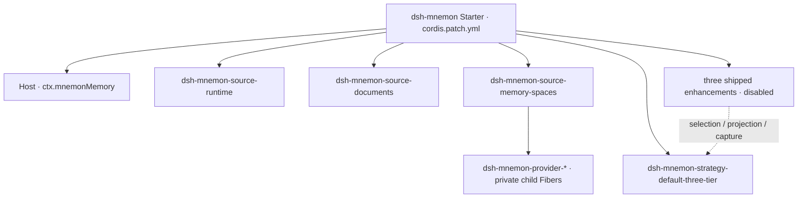
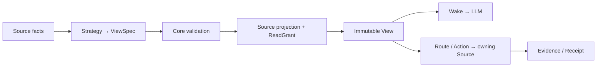

# Composable View Memory Architecture

[简体中文](../zh-CN/architecture.md) | **English** | [Documentation Center](./README.md)

The system has three domain concepts: a **Source** owns memory and its operations; a **Strategy** proposes how available Sources participate; a **View** is the bounded context and interaction shape presented to the LLM for one scope and scenario. Runtime, Documents and Memory Spaces are the default composition, not Core's universal memory taxonomy.

## Ownership and assembly



Solid edges show Starter installation ownership; the dotted edge shows Strategy contributions that take effect only after the user enables them, not business calls. DSH creates the top-level Entries/Fibers. Sources, Strategies and their contributions use the same `installMemory(ctx, ...)` SDK and Cordis-owned disposer. Core provides only `ctx.mnemonMemory`; it does not implement a Memory Spaces Fiber or publish `ctx.mnemonMemorySpace`.

Memory Spaces authors its **own** child Fibers and Provider protocol. Each configured Provider is an explicitly installed module; two Source instances can use the same child id without sharing their registry or credentials. No dependency scan or global Provider registry selects implementations.

Like a Spring Boot starter, the default distribution chooses dependencies and explicit defaults. It does not turn Source business code into Core. Users still install only `dsh-mnemon`; 16 plugin packages can be independently built, tested and published. The Starter installs every official package, with three Strategy enhancements shipped as disabled Entries that join the View only after their Settings switches are enabled. Complete Strategy replacement remains explicit.

| Owner | Owns | Does not own |
|---|---|---|
| Core | Internal registration, contract validation, immutable Views, budgets, generations and leases | Provider drivers, Source data formats/storage decisions, pages, DSH lifecycle policy |
| SDK | Small contribution service, Source/Strategy author contracts, installation helpers and scoped test tools | Engine/registry constructors, installed records or generation handles |
| Source | Storage/remote authority, facts, projections, grants, query/mutation and optional management/Client | Other Sources' controllers or global strategy selection |
| Strategy | Pure deterministic `request + facts + owned-slot contributions → ViewSpec`; owns slot semantics | Raw data, credentials, drivers, side effects or new authority |
| Host | Scope, phase hooks, tool/RPC adapters, authentication, settings and supervised tasks | Source implementations or private registries |
| Starter | Package set, Entry ids and default configuration | A second loader or runtime |

`ctx.mnemonMemory` is a real restricted service object, not the engine cast to a narrower type. It exposes one registration primitive, used through `installMemory`; Host execution stays internal. Provider modules follow the same principle inside their own Source, with only a bound `host.install` capability. Public test fixtures exercise these protocols without handing out their private owners.

## Default plugin combination

| Plugin | Memory authority | Default View contribution |
|---|---|---|
| `dsh-mnemon-source-runtime` | Runtime JSON, USER/MEMORY projections, branch filtering, capacity | Exact working context, eager |
| `dsh-mnemon-source-documents` | Managed Markdown, index, search, revision and archive | Bounded narrative cover and search route |
| `dsh-mnemon-source-memory-spaces` | Space directory, private Providers, capability/quality policy | Bounded durable-evidence cover and recall/related routes |
| `dsh-mnemon-strategy-default-three-tier` | No memory storage | Selects the three roles and allocates projection/routes/actions |

The nine independent Provider plugin packages are `dsh-mnemon-provider-{mnemon-native,openviking,honcho,mem0,hindsight,holographic,retaindb,byterover,supermemory}`. A Provider runs *inside* Memory Spaces as its storage/retrieval driver, not as a new Core contribution. A Git/Notion/health plugin should normally be a Source; an alternate way to combine them is a Strategy.

The unextended default Strategy rejects duplicate roles. Enable `strategy-scoped` to compose multiple instances explicitly; disabling restores that ambiguity check rather than guessing by load order. The default Strategy owns its three extension slots. Core only carries bounded contributions and enforces the existing budget and authority contract.

## View data flow



A View holds projection fragments, routes, action offers and Host-only ReadGrants. Only its bounded model-facing representation enters Wake; private grant payloads, controller handles and credentials do not. Route/action schemas accompany the offers. Evidence records provenance and consistency; it is not a new persistent memory store.

Strategy output is only a proposal. Core validates instance identity, manifest capabilities, allowed routes/actions and budgets. The Host checks current authority on execution. Source consistency is explicit: `exact-snapshot` for a captured document/runtime snapshot, or `namespace-pinned-live-read` for a Provider whose namespace can be pinned but remote contents remain live. The latter never promises historical database snapshots.

```mermaid
sequenceDiagram
  participant DSH
  participant Host
  participant Core
  participant Source
  participant LLM
  DSH->>Host: turn begins (scope, scenario)
  Host->>Core: acquire Serving generation; compose
  Core->>Source: facts; project after Strategy selection
  Source-->>Core: fragments + opaque ReadGrant
  Core-->>Host: immutable View
  Host->>LLM: own plugin message: bounded Wake + routes/actions
  LLM->>Host: selected route/action + input
  Host->>Core: scope, authority and budget checks
  Core->>Source: query / mutate
  Source-->>LLM: bounded Evidence / committed Receipt via Host
  DSH->>Host: turn ends
  Host->>Core: release lease; drain retired generation
```

## Lifecycle and failures

Candidate composition is validated before publication. A rejected additional candidate does not silently replace the Serving generation. Explicit removal of a required contribution retires that generation and prevents new turns from acquiring it. Existing turns and in-flight operations retain leases until they finish; then the old Source runtime and private resources drain.

Each turn pins one immutable View. Writes yield receipts; later turns see new revisions. Concurrent root/child work cannot substitute another turn's grant. A Source/Provider failure remains scoped and observable; partial, failed, cancelled and committed results are not conflated. Disabling participation does not delete data.

A child captures its delegated View and generation at dispatch, retaining both until disposal even if the parent completes or the Serving generation changes. Each child execution has its own turn identity and retrieval budget; it never falls back to the parent's latest View. Wake is appended after shared context as a `dsh-mnemon` plugin message, without reinjecting or interpolating other plugins' context.

## WebUI and management

Each Source owns its optional `./client` DSH module, pages, management operations and tests. It registers through the public Source-page SDK into the workspace's `mnemon.source.page` Slot. DSH still owns Client lifecycle and React rendering.

The Host supplies a scoped management client and sanitized instance metadata, not raw RPC/Host Context or an LLM grant. Reads and confirmed revision-fenced mutations address one Source. Default workflow assistance (such as Document-to-Space archival) lives in Host coordination and uses those same public operations.

One shared workspace has two mutually exclusive DSH placements. Sidebar uses `shell.overlay`, opens without a conversation, and keeps its own workspace selection. The same DSH-owned subtree retains Source page state while another panel is active; the launcher coordinates with Taskboard/SSH and restores chat interaction on close. Builtin uses `conversation.view` and the owning session's storage scope for reads, writes and tasks, with no independent workspace picker. Both placements render the same Source-owned child Slots. No separate React root, fallback page registry or cloned business page exists.

## Compatibility and future evolution

The default Starter retains storage selection, persisted formats, named tools and user workflows. `displayMode` selects `sidebar` (default) or `builtin`; the Host accepts legacy `buildin` and saves the canonical spelling through DSH's revision-fenced settings writer when writable. This changes one preference, not memory data or Core/Source contracts. Other configuration keys retain their meaning. This does **not** preserve private controllers, old `kernel/layers/provider-sdk` root exports or historical wrapper packages. The current public entry list is in [Extension development](./extensions.md).

The RSI seam is deliberately small: create a candidate Source/Strategy artifact, test/replay it with fixed facts and requests, review its requested authority, then install/select it normally. Generations support verified replacement and drain; they are not an autonomous code-execution or promotion service. Cordis ownership/isolation is not a security sandbox. High-risk external actions require a separate authority boundary and are not authorized merely by being called “memory”.
