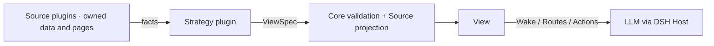

# Project Overview: Three-Tier and Cross-Agent Memory for DSH

[简体中文](../zh-CN/project-overview.md) | **English** | [Documentation hub](./README.md)

`dsh-mnemon` integrates long-term Memory Spaces with DeepSeek Harness, then adds Runtime hot memory, Project Documents, lifecycle routing, independent task Agents, a deterministic control layer, and native DSH interfaces. The third tier is provider-backed: Mnemon Native is the official, prioritized, full-capability implementation, while eight third-party engines reuse the same workflow through explicit adapters.

Runtime, Documents and Memory Spaces are independent Source plugins. A Strategy selects their instance-specific projections, retrieval routes and actions into an immutable per-turn View. Core provides only `ctx.mnemonMemory`; Sources own their data and optional pages, while Memory Spaces owns its private Provider children. The `dsh-mnemon` Starter preserves the default three-tier experience. See [Architecture](./architecture.md) and [Plugin development](./extensions.md).

Its goal is not to store more text. It balances long-term continuity, current-fact priority, context cost, and recoverable writes.

## Why three tiers

One memory tier cannot serve frequent injection, full-document reading, and cross-session recall equally well:

| Need | With one memory tier | dsh-mnemon's choice |
|---|---|---|
| Know stable preferences and rules on the next turn | Retrieval adds latency and may miss | Inject compact Runtime projections every turn |
| Read a complete design, investigation, or procedure | Fragmentation loses narrative and provenance | Keep managed Markdown Documents |
| Find cross-session facts, decisions, and relations | Full loading pollutes context | Recall bounded graph-enhanced evidence on demand |
| Preserve traceability for cold long-form material | Keeping it hot consumes capacity forever | Create a cold reference before moving the original |
| Let a model judge value without owning system safety | An LLM cannot guarantee paths, locks, or transactions | Independent task Agents own semantics; the Host owns hard boundaries |

Priority always remains: **current user instructions → live tools and repository facts → historical memory**.

## The three-tier model

### 1. Runtime Memory

Runtime retains compact, high-frequency information useful on many turns:

- `USER.md`: identity, roles, preferences, habits, and explicit collaboration requirements;
- `MEMORY.md`: project conventions, environment facts, decisions, tool behavior, and reusable lessons.

`runtime/memories.json` is the source of truth; both Markdown files are deterministic projections. USER is capped at 4 KiB and MEMORY at 10 KiB, measured in UTF-8 bytes. Regular mutations are deterministic; only capacity maintenance may start an internal worker.

### 2. Project Documents

Documents preserve complete designs, investigations, procedures, postmortems, and handoffs. Title, retrieval description, and body participate in deterministic search; the body keeps Markdown structure.

One body may be up to 2 MiB and active rendered content up to 10 MiB. Before manual or capacity archiving, an independent task Agent uses a bounded internal worker to write a Mnemon cold reference containing a summary and SHA-256. The original moves only if its revision is unchanged. Failure or conflict preserves active content.

### 3. Memory Spaces

Each Memory Space has a stable ID, name, routing description, activation state, and provider capability set. Mnemon Native maps to an independent Store and `mnemon.db`; third-party spaces map to their provider's endpoint, scope, local file, or CLI directory. Activation remains DSH's unified read-and-routing control plane and may select zero or many spaces; Mnemon's native default Store remains an independent single selection.

- Reads cover active spaces only.
- Writes may target any registered space and activate it after success.
- Cross-provider recall retains Memory Space and provider provenance, applies the configured pluggable quality policy before content reaches an Agent, and fuses each engine's internal ranking instead of comparing heterogeneous raw scores. The default strict policy drops normalized scores below `0.25`, keeps all high-relevance rows within the request limit, and budgets medium and unknown-scale evidence instead of filling the limit.
- Relationships, entities, deletion, and write semantics follow the target provider's declared capabilities. Mnemon Native keeps the complete graph and soft delete; external engines expose only the semantics documented in the [provider matrix](./memory-providers.md).

See [Storage and the three-tier model](./storage-model.md) for authoritative files, capacities, and directories.

## Cross-agent sharing boundary

“Sharing” does not mean that dsh-mnemon broadcasts conversations or files to arbitrary agents. It means that multiple Mnemon-enabled agents use the same local Mnemon data:

1. every participant installs and integrates Mnemon;
2. every participant can access the same `storageRoot`;
3. durable memories intended for sharing live in Mnemon Stores recognized by those participants.

Under those conditions, another Mnemon-enabled agent can recall durable facts, entities, and relations in Mnemon Native spaces, and DSH can discover compatible memories written in the other direction. Third-party spaces share through their own provider scope. This boundary covers third-tier provider data only; `runtime/` and `documents/` do not automatically become another agent's context.

The default `global` root, `~/.mnemon`, is the simplest choice for several local agents. Use `custom` for an explicitly agreed shared root, or `workspace` to constrain sharing to one project. Concurrent processes rely on Mnemon and SQLite concurrency semantics; stop every user before offline copying, migration, or direct database changes.

## Architecture

Four boundaries shape the system:

1. **Interaction**: conversation, Sidebar workbench, `/mnemon` commands, and model tools.
2. **Supervision**: user-visible AI metadata, Agent Query, semantic writes, and archiving run in independent top-level task Agents; bounded internal workers are used only for structured judgment.
3. **Deterministic control**: the Host enforces scope and authority; each Source enforces schema, paths, capacity, locks, revisions and driver timeouts.
4. **Data**: Runtime, Documents, and Mnemon Native data live under the effective `storageRoot`; external providers are reached only by the Host through explicit connections, never directly by the browser.

### Memory System flow

This diagram describes stable execution boundaries, not a live status dashboard. Solid lines are deterministic Host paths; dashed lines are independent task-Agent paths.

The four visible flows are:

- **Deterministic reads**: Status, direct search, Content, and Entities load concurrently and render as results arrive.
- **Agent Query**: bounded evidence is recalled first, then a clean task Agent with no Mnemon tools organizes the answer.
- **Supervised writes**: after user confirmation, a task Agent qualifies, deduplicates, distills, and routes; the Host enforces permission and transaction boundaries.
- **Maintenance and archive**: AI metadata tasks are isolated per space; Documents move only after a cold reference crosses the revision fence.

See [Lifecycle and workflows](./workflows.md) for thresholds, cancellation, and failure semantics.

## Read path: near to far

A history-dependent request expands in this order:

1. current request, live tool results, and repository files;
2. Runtime Memory already in the prompt;
3. deterministic search and on-demand full text from active Documents;
4. supervised recall from active Memory Spaces;
5. archived originals only after following a cold-reference hit.

`mnemon_recall` starts an isolated worker. It selects the narrowest spaces from names and descriptions and can use only allowed recall/related tools. The complete catalog and routing trace do not fill the root conversation.

Direct recall in the Web returns raw evidence. Agent Query retrieves the same evidence, then gives it to an evidence-only top-level task Agent with no Mnemon tools.

## Write path: semantics versus guarantees

| Independent task Agent / internal worker | Host guarantees |
|---|---|
| Decide whether a candidate is durable | Input schema and operation permissions |
| Select the narrowest space and deduplicate | Workspace and path confinement |
| Distill self-contained content and relation rationale | Shell-free CLI, bounded output, timeout, and cancellation |
| Decide when long-form work belongs in Documents | Locks, temporary files, rename, and revision fences |
| Maintain conservatively within its persona | UTF-8 capacity and original-data preservation on failure |

Durable recall and related reads run directly through the Host under the pinned MemorySource authority. Semantic writes may use an isolated `spawn`; score-based background review uses `fork` only after a completed turn crosses its threshold and remains idle. A new turn cancels pending or running review.

## What users see

The default Sidebar has four primary pages: Status, Runtime, Documents, and Memory Spaces. Memory Spaces adds Overview, Recall, Content, and Entities. Add, edit, and Remember use consistent dialogs; long collections use filters and progressive loading.

Two additive entries surface memory in conversations:

- **Turn memory** summarizes this turn's memory tools and links to matching pages.
- **Save to memory** loads a finalized reply into an editable confirmation; supervised writing starts only after confirmation.

See the [Sidebar and conversation UI guide](./ui-guide.md) for screenshots and workspace inspection/execution semantics. See [Interfaces](./interfaces.md) for tools, commands, and RPC.

## Local-first reliability

- CLI calls use argument arrays with `shell=false`, bounded output, timeout, and cancellation.
- Runtime and Documents use in-process queues, cross-instance locks, temporary files, and rename.
- Runtime revisions block stale compaction; Document revisions block movement of updated originals.
- Independent task Agents and bounded internal workers use personas, tool allowlists, schema-validated one-run result tools, and depth limits.
- The WebUI never reads SQLite directly or supplies arbitrary update commands.
- The plugin stores no model credentials, but it does not yet include a deterministic secret scanner.

These guarantees are not a rollback-capable distributed transaction across Mnemon SQLite and the filesystem. When uncertain, the system preserves original data. See [Operations](./operations.md) for complete boundaries and limitations.

## Continue reading

- [Getting Started](./getting-started.md): installation and first verification.
- [Sidebar and conversation UI guide](./ui-guide.md): complete visual workflow.
- [Architecture](./architecture.md): modules, workers, and trust boundaries.
- [Storage model](./storage-model.md): directories, capacity, and authority.
- [Lifecycle and workflows](./workflows.md): injection, recall, writing, review, and archive.
- [Configuration](./configuration.md): display, storage, and advanced switches.
