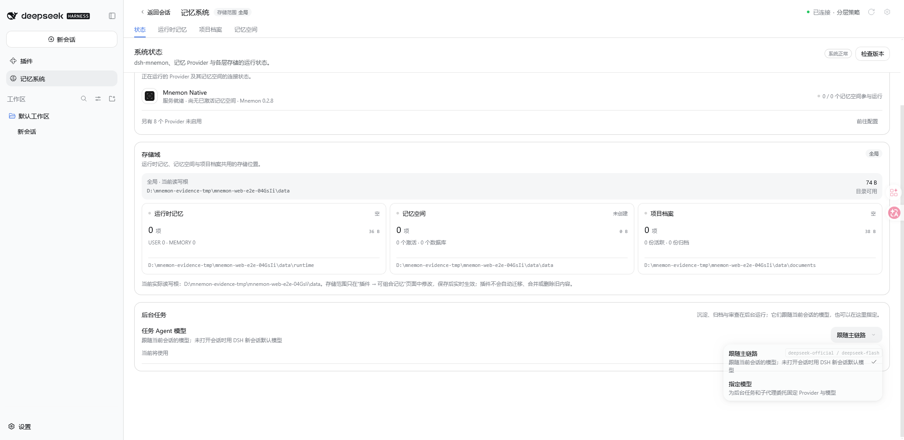
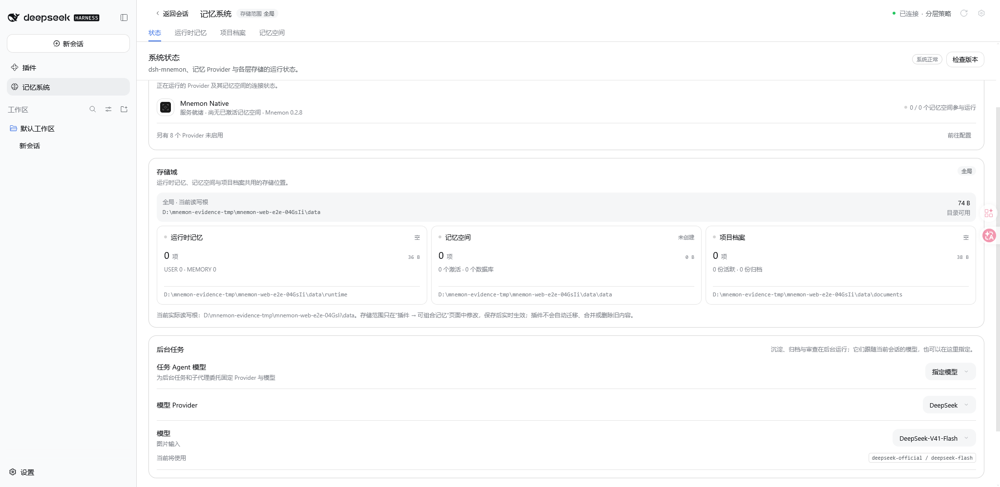
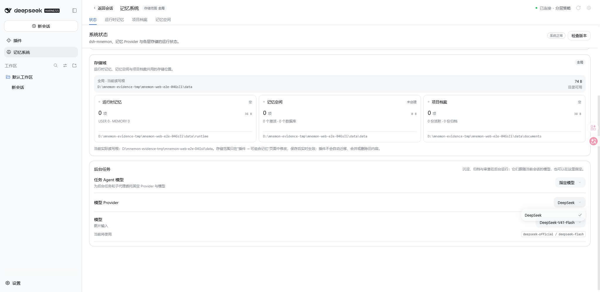

# 状态页的后台任务

[English](./README.md)

被测实现：`7229e348`。Windows 11、Node 22.22.0、Git 2.55.0.windows.5、pnpm 11.7.0，由 `scripts/serve-e2e.mjs` 启动的真实 `dsh web` 实例，使用一次性 profile 与环回模型桩。图中存储根是该 fixture 自己的一次性目录；未使用任何个人记忆或凭据。

## 当前会话将使用的路由

状态页带一张**后台任务**卡片，说明后台工作走哪条路由，并在下面给出这条路由此刻解析到的 Provider 与模型。标题里写明了「未打开会话时」的回退。



## 不离开页面就能选路由

路由控件展开一个菜单，给出两条路由：跟随当前会话，或指定一个 Provider 与模型。选第二条时，Provider 与模型两行就地展开，读者不必打开插件配置页来改这一项。



Provider 行列出该 Host 实际能连上的 Provider；模型行列出该 Provider 的模型，并标出支持图片输入的项。



## 页面写下了什么

选路由是一次 profile 写入，不是页面本地偏好。选定「指定模型」后，profile 的 patch 文件里是：

```yaml
taskAgentModel:
  mode: fixed
  provider: deepseek-official
  model: deepseek-flash
```

切回「跟随主链路」后这两个字段被移除，只留 `mode: inherit`，因此这个选择可以撤回。

当 Host 报告设置不可写时，同一个控件保持只读；模型目录读取失败时卡片会直接说明，而不是静默回退。
