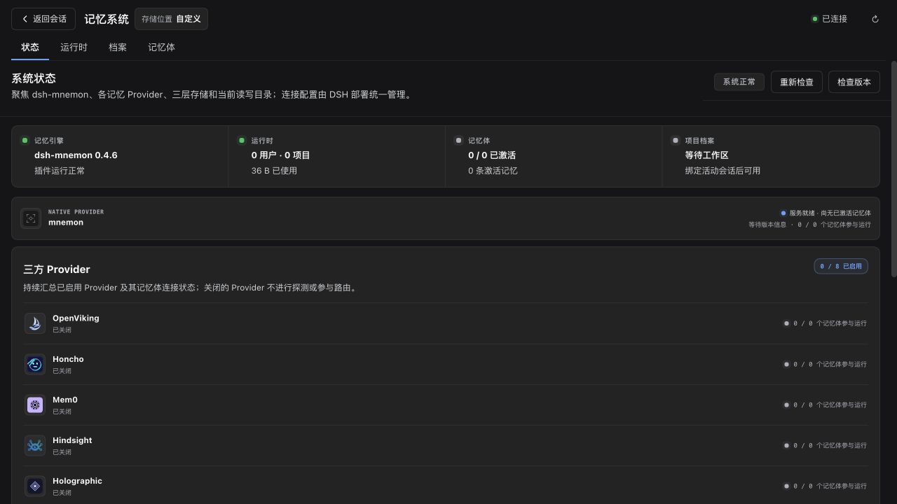
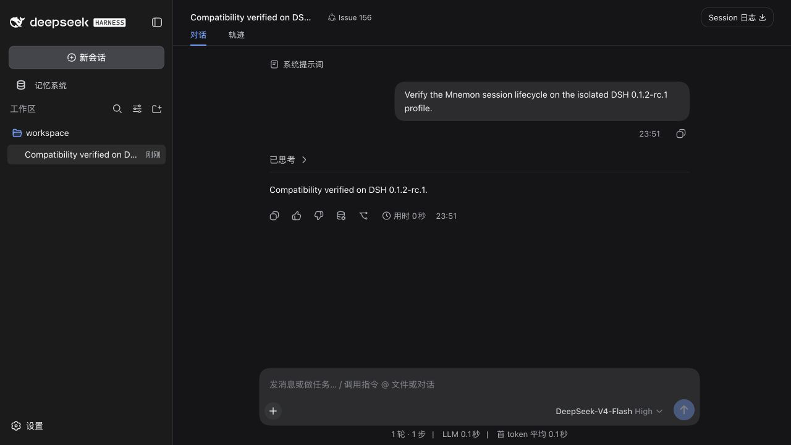
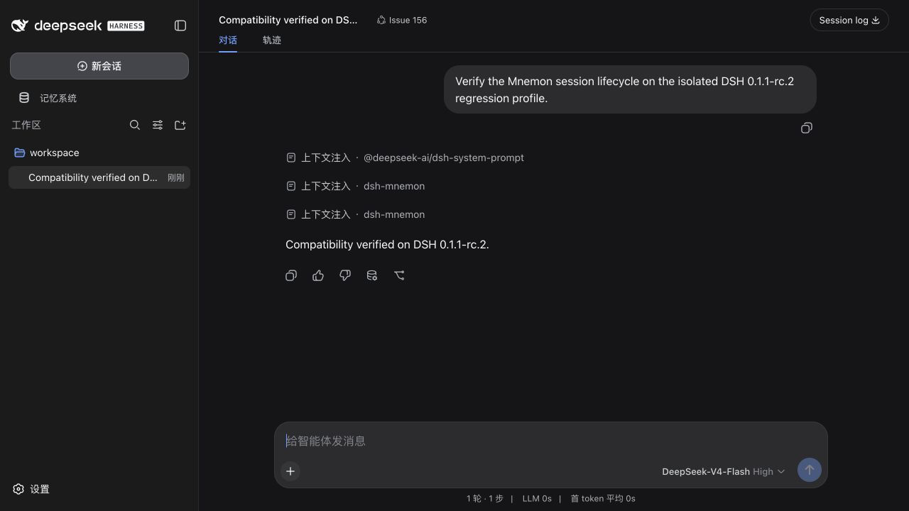

# DSH prerelease compatibility evidence

Captured on 2026-09-03 from implementation commit `3c5b28919649f6b2aa6d1696497c234f0784d657`, based on `origin/main` commit `f6cb0c7f13f346f07fa03afed4fd07917ed61059`.

Every WebUI run used a fresh `DSH_HOME`, Mnemon data root, and workspace. Model traffic stayed on localhost and returned a deterministic synthetic SSE response; memory writes were disabled. The fixture used Mnemon CLI 0.2.6 with SHA-256 `b1bf3e8e315474bb71e83f94893df6247db7d2fbcad685bee2b914e6d1110609`. No credentials, personal memory, or private workspace content are present in these artifacts.

## Verification matrix

| DSH version | Dependency mode | Result |
| --- | --- | --- |
| `0.1.2-rc.1` | Exact registry packages | Full `pnpm run verify` passed: typecheck, 654 tests with one Windows-only skip, deterministic build, isolated Headless smoke, package-content checks, publint, and attw. The independent WebUI passed plugin/status loading, Runtime/Documents/Memory Spaces navigation, a synthetic conversation, the read-only save-to-memory dialog, and reload persistence. Browser warning/error logs and matching Host diagnostics were empty. |
| `0.1.2-alpha.5` | Built upstream source overlay at `db6bdc3576c2d4e7c965e8e3ed0c2a731eed87f5` | The same full verification chain passed after linking all 23 direct build-time packages, including Store and Invariants. Registry links were restored afterward. |
| `0.1.1-rc.2` | Exact registry package | The backward-regression WebUI passed memory-system loading, a synthetic conversation, and reload persistence in a separate profile. Browser warning/error logs and matching Host diagnostics were empty. |

## DSH 0.1.2-rc.1

The Mnemon status page reports `系统正常` and plugin version 0.4.6:

The isolated conversation completed and remained present after a full page reload:

## DSH 0.1.1-rc.2 backward regression

The previous registry baseline still completes the same isolated conversation flow:

