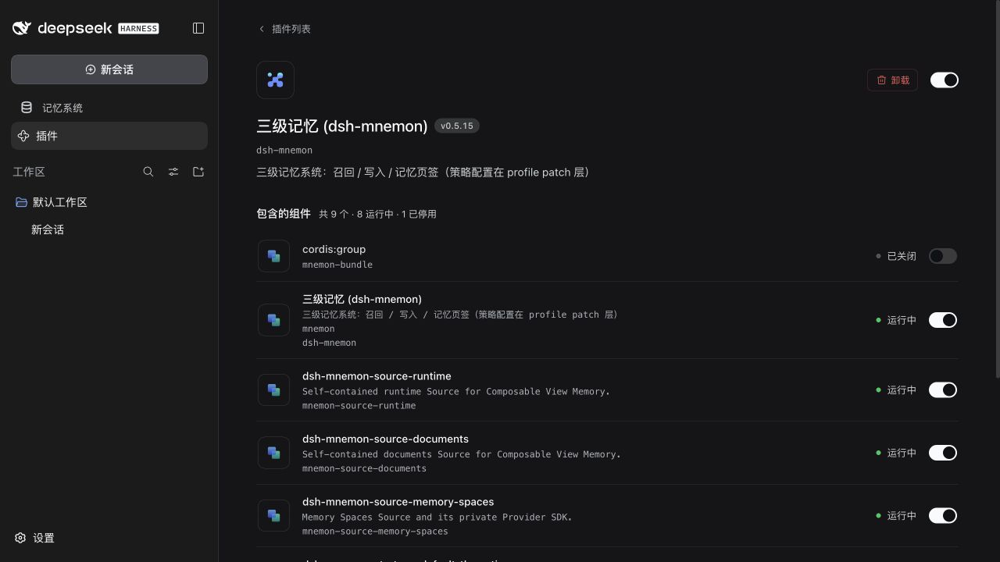
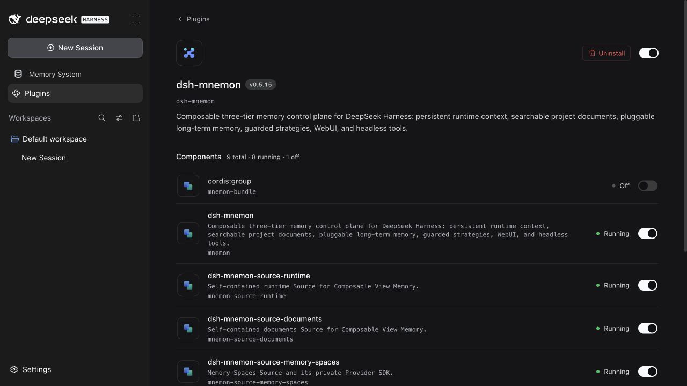

# DSH plugin metadata — PR #286

[简体中文](./README.zh-CN.md) | **English**

Verified on 2026-09-26 at `84dc35aaa832e341a01add4b4e934a90a056c46b`, which appends validation and release maintenance to contributor commit `d16d017aa5bb0c3bbbdb40dc5a95554266b6522a`. The original commit, locale wording, and package changes are preserved.

## Environment and reproduction

- Node 24.20.0 and pnpm 10.13.1 on macOS.
- The repository's pinned DSH 0.1.5-rc.1 cohort for the full workspace and packed-artifact suites; a separate published DSH 0.1.7-rc.2 profile for metadata and browser acceptance.
- The browser profile installed all 17 packed Mnemon artifacts and enabled the three optional Strategy extensions. It used isolated synthetic state, official DSH UI, no additional skins, and no external model or Provider API.
- The root tarball is `dsh-mnemon-0.5.15.tgz`, SHA-256 `c36e723d632895108b8e8fcbdf8a8e15a79fd7362143758691b9f2bbebd1d301`. It contains the PR changes without a release version bump. The browser used these exact bytes.

Build and pack the PR, install its tarballs into a disposable DSH profile, and restart the profile. Open **Plugins**, select **dsh-mnemon**, and inspect the Chinese display text. Change **Settings → General → Language** to English, close Settings, and inspect the same plugin again. Both captures below use a 1280 × 720 viewport.

## Visible result

The Chinese plugin details and component row show `三级记忆 (dsh-mnemon)` and the contributor's Chinese description.



The same entry in English shows the existing `dsh-mnemon` name and complete package description.



The visible `cordis:group` Off status alongside running children is a separate pre-existing status issue under investigation. These captures validate metadata display, not group enable/disable behavior.

## Verification

```sh
pnpm exec vitest run tests/package-locales.spec.mjs tests/release.spec.mjs
pnpm verify
pnpm verify:plugins
pnpm release:intent
```

- All 42 focused tests passed, including 23 locale-resource cases. Rejected inputs cover incorrect wildcard/concrete export targets, missing `en.json`, invalid filenames and directories, malformed JSON, non-object dictionaries/metadata, and blank or non-string display fields.
- Full workspace verification passed: deterministic builds, independent plugin types/tests, 1,403 root tests, real Headless activation, package contents, public entries, and package lint. Eight opt-in root tests were skipped by default. Existing performance and package limits were retained.
- Packed verification passed for 16 independent plugin repositories and 17 artifacts, including external consumer build/types/tests, the real Starter upgrade from 0.4.7, and simultaneous activation of the three optional Strategy plugins.
- Release-intent verification confirmed the root patch changeset. A locale-only edit now requires release intent and a version change when preparing a release.
- The package has 52 files and 1,374,969 unpacked bytes, below the unchanged 1,376,000-byte ceiling.

The published DSH `readPluginMeta()` from `@deepseek-ai/dsh-app-boot@0.1.7-rc.2` also read the freshly extracted tarball. Its English title and description matched the baseline package's display text exactly; its Chinese fields matched the screenshot. [Sanitized result](./metadata-verification.json).

This change covers the root plugin's metadata only. It does not translate every component package, change configuration or stored memory, or certify all DSH releases, desktop skins, or remote Providers. The UI, getting-started, configuration, and operations guides were reviewed in both languages; their procedures remain applicable.
