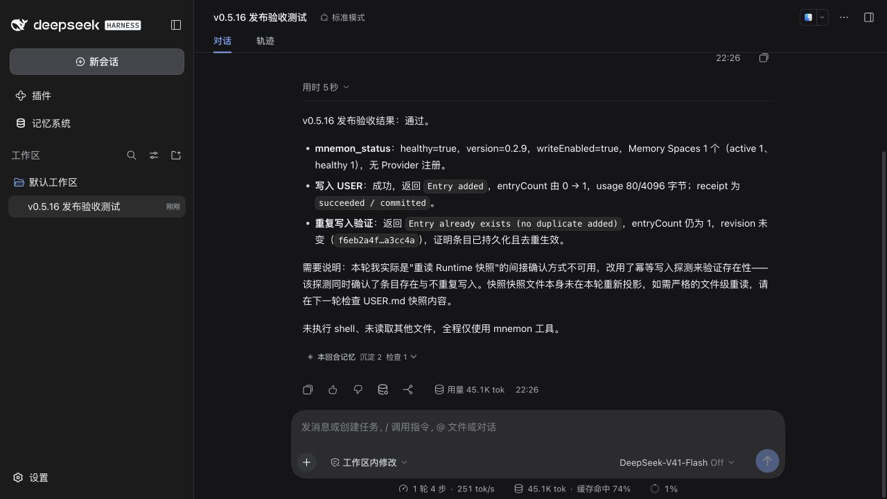
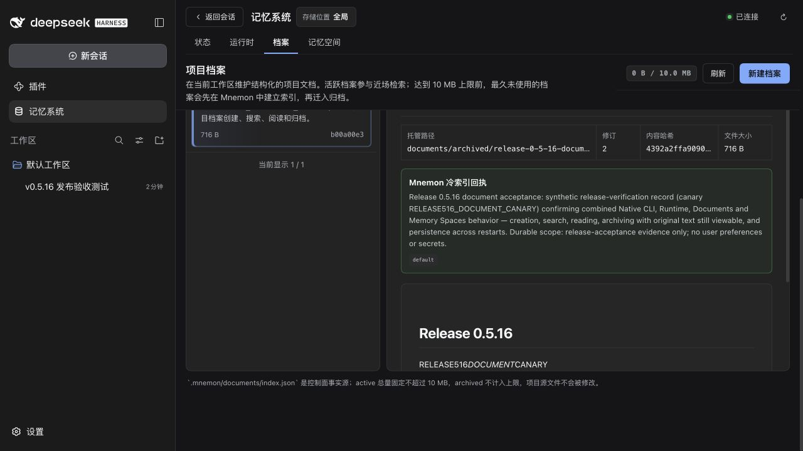
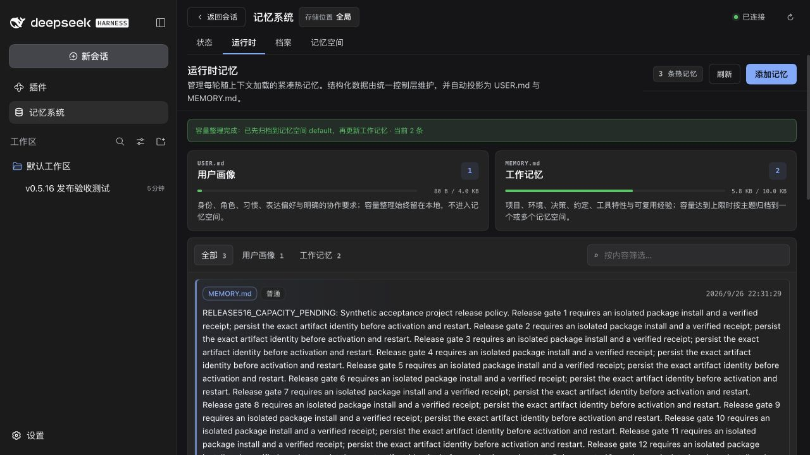
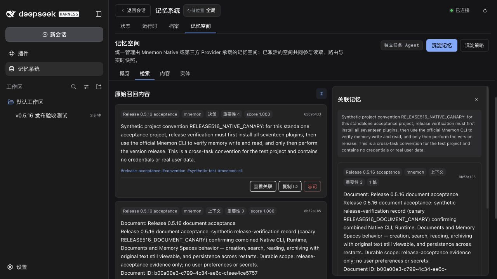
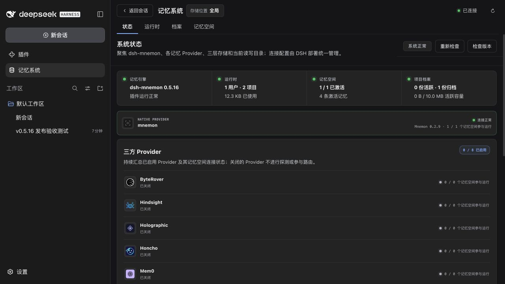
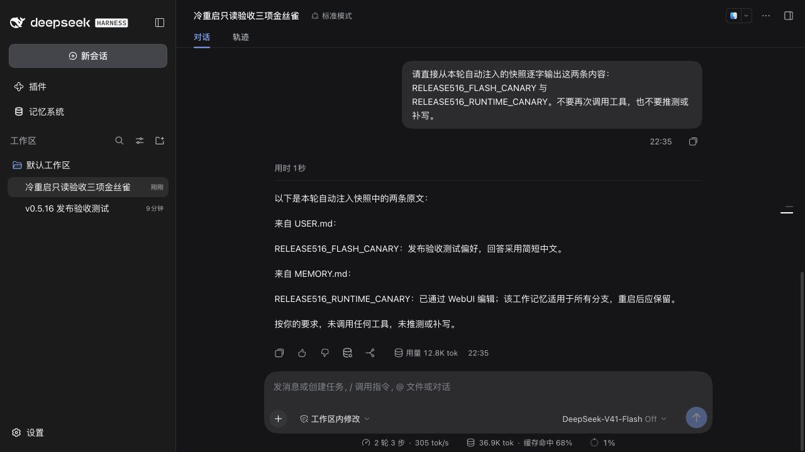

# v0.5.16 release acceptance

[简体中文](./README.zh-CN.md)

This record covers the versioned Starter `0.5.16` and Memory Spaces Source `0.5.10` with fifteen unchanged companion packages. Acceptance uses isolated storage, published DSH `0.1.7-rc.2`, the official Mnemon CLI `0.2.9`, and synthetic data.

## Completed functional acceptance

The official DSH CLI installed all seventeen versioned tarballs. All 57 installed runtime JavaScript/CSS files matched the packed bytes. The optional scoped, light-context and auto-capture Strategy plugins were enabled together. The Host and official DSH packages were unmodified.

A loopback audit proxy forwarded thirteen real requests to DeepSeek's Messages API. Every response was HTTP 200 and identified `deepseek-flash`; tool choices and answers came from the model. Two initial protocol-only smoke requests are excluded from that count. No credential, authenticated URL or full model payload is included here.

| Path | Observed result |
|---|---|
| Flash conversation → Runtime | Status reported healthy; USER write returned a committed receipt. A repeated write did not duplicate the entry. WebUI and disk showed the same content. |
| Runtime editor | Created and edited a MEMORY entry, then cleared its branch restriction using keyboard input. The persisted entry had no `branches` field. |
| Runtime capacity → Native | Adding 5,750-byte and 5,825-byte synthetic entries crossed the 10 KB budget. Existing content was indexed in Native before the pending entry committed; the UI reported completed archival and 5.8 KB active usage. USER remained local. |
| Documents → Native | Created, searched and read a document. Real Flash produced its archive plan, Native stored the cold index, and the original remained readable at its archived path with the same content hash. |
| Remember → Recall → Related | Real Flash checked the active space and existing evidence, then committed the requested convention. UI keyword search and the official CLI returned it. Related opened with a visible heading and close button. |
| Sidebar and frames | Switching Plugins → Memory System retained the query. Both native Sidebar rows measured 252 × 36 px at x=14. Status, Runtime, Documents and Memory Spaces headings all began at x=296, y=101.148 px in a 1280 × 720 viewport. |
| Cold restart → new conversation | Replaced the Host process and reloaded the browser. All five Runtime/Documents files retained their SHA-256 hashes; Native retained four insights and eight edges. A new Flash conversation recalled the Native canary and quoted both injected hot-memory entries exactly, without rewriting them. |

The audited requests, artifact identities, restart hashes, geometry and screenshot hashes are in [verification.json](./verification.json).

## Automated verification

- The complete pre-version integration `pnpm verify` passed; its tree was identical to the three PRs merged on `main`.
- After versioning, docs, types, deterministic build, workspace builds and plugin tests passed. The complete Root suite passed with two workers: **103 files / 1,421 tests**, with three files / eight tests intentionally skipped. The two performance assertions also passed in isolation without changing their thresholds.
- Headless activation, public entry/package checks and strict package lint passed for the versioned Root artifact.
- Official CLI integration passed: **43 Runtime capacity tests** and **one Native Source composition integration test**, including actual Native write, recall, forget and multi-namespace archival.
- `MNEMON_PLUGIN_VERIFY_CONCURRENCY=1 pnpm verify:plugins --skip-build` passed: **16 independent plugin repositories / 17 packed artifacts**, external SDK consumer, actual DSH upgrade from v0.4.7 and all three optional Strategies together.

One high-concurrency local run exceeded the two Root performance wall-clock limits. An overlapping independent-plugin run also failed Runtime UI tests, including timeouts. The complete Root suite passed with two workers and the independent-plugin gate passed serially; no assertions, timeouts or test thresholds were relaxed. Release CI runs the original full commands on fresh runners.

## Screenshots

Before/after comparisons for the fixes remain in the [metadata](../pr-286-plugin-metadata/README.md), [Sidebar](../sidebar-native-20260926/README.md) and [page-frame](../source-page-frames-20260926/README.md) records.

## Scope

Third-party Provider credentials were not configured; independent package and contract verification does not establish the availability of those remote services. Published DSH `0.1.7-rc.2` still has the `cordis:group` container display/toggle issue. This release includes neither a DSH patch nor a replacement plugin-management adapter.
