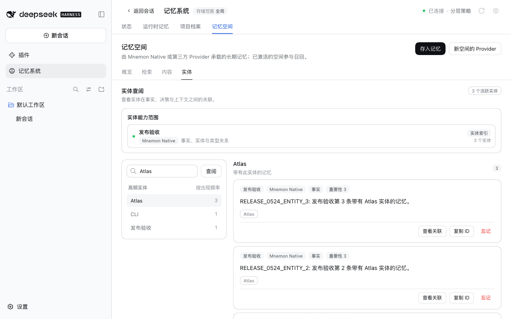
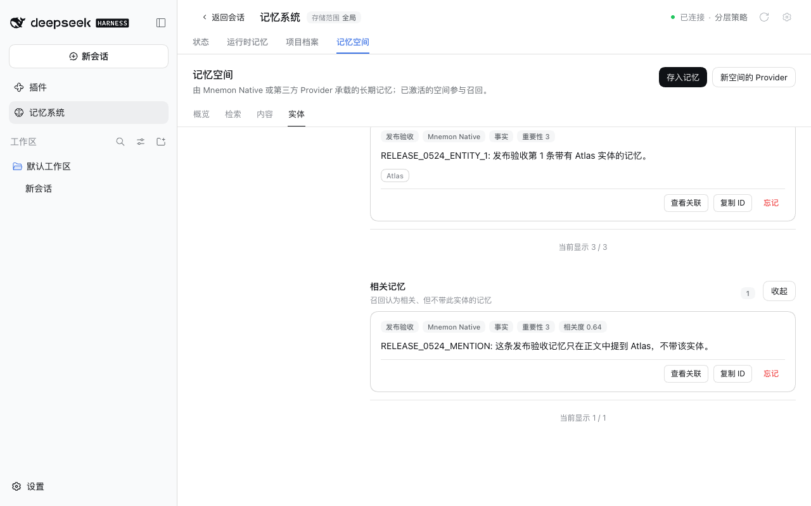

# v0.5.24 发布验收

[English](README.md)

验证日期为 2026-10-04（北京时间）。被测包为 `dsh-mnemon@0.5.24` 与 `dsh-mnemon-source-memory-spaces@0.5.16`，由 `pnpm release:version` 从包含 #332 的 `main` `b2481b04` 构建。其余 16 个组件包按 Starter 锁定的版本取自 npm，0.5.24 没有改动它们。

## 两个支持的宿主上的真实官方 WebUI

在未修改的 npm DSH `0.2.0-rc.2`（npm `latest` 与 `next`）与 `0.1.7-rc.2` 上，各自使用 Node `24.19.0`，以及全新的 home、DSH home 与 pnpm store：

1. 在未安装 Mnemon 的情况下启动宿主，打开**插件 → 添加插件**。
2. 安装 `dsh-mnemon`。安装源由 DSH 自行选择，其测速选中了中国大陆镜像源。本地回环 registry 返回 npm 的真实元数据，并加上两个新版本。安装后 profile 中为 dsh-mnemon 0.5.24 与 Memory Spaces 0.5.16，其余组件均为锁定的 npm 版本。
3. 点击**立即启用**，无需重启宿主即出现记忆系统。[状态页](status.png)显示 **dsh-mnemon 0.5.24 / 系统正常**，Mnemon Native 显示 **Mnemon 0.2.9**。
4. 添加一条运行时记忆，刷新页面后读回：[运行时记忆](runtime.png)。
5. 在 WebUI 中创建并激活一个 Mnemon Native 空间：[记忆空间](spaces.png)。用 Mnemon CLI `0.2.9` 写入一条事实并用 CLI 召回，再用 WebUI 的**直接检索**找到同一条事实：[检索](recall.png)。
6. 再用 CLI 写入三条带有实体 `Atlas` 的记忆，以及一条只在正文中提到 Atlas 的记忆。在**实体**页，`Atlas` 计数为 3，选中后正好列出这三条（“当前显示 3 / 3”）。相关记忆折叠在**查找相关记忆**之后，没有运行召回：[实体](entities.png)。点击后找到了只提到 Atlas 的那条记忆，按钮变为**收起**：[相关记忆](entities-related.png)。
7. 打开**检查版本**。dsh-mnemon 显示已安装 0.5.24，更新方式为 DSH 自己的插件安装器。发布前 npm 的 latest 仍是 0.5.23，因此对话框把 0.5.24 标为本地版本，不为它提供更新。Mnemon CLI 一行提供自己的 npm 更新，因为 npm 上已有 Mnemon 0.2.10。点击**立即启用**后没有出现重启提示，因为正在运行的就是已安装的版本。

两个宿主都通过了每一步，没有宿主警告或控制台错误，每个宿主进程只启动一次。包摘要与各宿主的结果见 [validation.json](validation.json)。Profile 与记忆均为合成数据。

## 本版本的修复

[实体页的计数与列表来自全部记忆](../entities-complete-index/README.zh-CN.md)记录了两个宿主上合成空间的修复前后、4 × 500 条记忆上的计时，以及报告所用导出数据副本上的计数。

## 验证与发布边界

`pnpm run release:check` 确认 `latest` 标签上的 Starter 0.5.24 锁定 Memory Spaces 0.5.16；发布流程按上一个版本计算变更的包。没有插件用到 Starter 新增的 SDK 导出，因此 peer 下限不变。版本号变更只改动 lockfile 中的两行版本说明，CI 使用的 pnpm 10.13.1 以 `--frozen-lockfile` 接受它。

版本 PR 与发布工作流都运行完整的工作区与打包插件验证。发布流程随后：
- 冻结合并后的 main revision；
- 发布变更的包，并从 npm 读回；
- 安装完整的 18 个包组合，并检查真实 Registry 升级；
- 创建 GitHub Release。

这些截图展示的是带版本号的本地包，本身并不证明 npm 发布。
