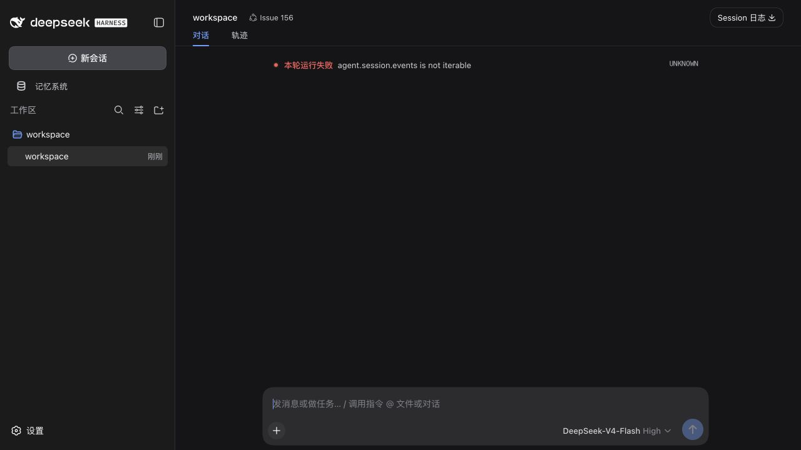
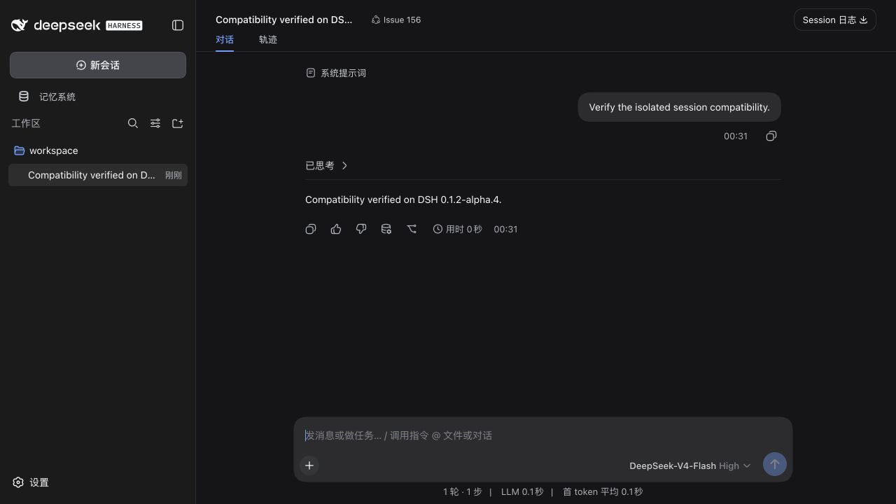
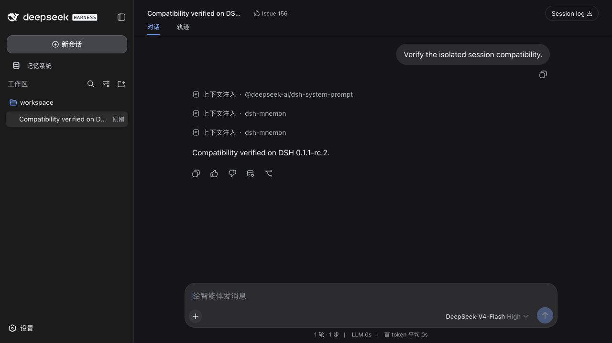

# Issue #156 WebUI compatibility evidence

Captured on 2026-09-03 from an isolated workspace based on `main` commit
`5153096ac5ad41fe50950114131243b9eb2d18cb`.

Each run used a fresh DSH home, data directory, and workspace. The real DSH WebUI
was driven through a deterministic local SSE model; no existing user profile or
remote model was used. The Mnemon CLI was version 0.2.6 (SHA-256
`b1bf3e8e315474bb71e83f94893df6247db7d2fbcad685bee2b914e6d1110609`).

| DSH | Mnemon plugin | Result |
| --- | --- | --- |
| 0.1.2-alpha.4 | published 0.4.4 | Reproduced `agent.session.events is not iterable` |
| 0.1.2-alpha.4 | this branch | Completed: `Compatibility verified on DSH 0.1.2-alpha.4.` |
| 0.1.2-alpha.5 | this branch | Completed: `Compatibility verified on DSH 0.1.2-alpha.5.` |
| 0.1.1-rc.2 | this branch | Completed: `Compatibility verified on DSH 0.1.1-rc.2.` |

The three successful runs produced no browser-console errors or warnings. Host
logs also contained no `error`, `warn`, or `not iterable` matches.

## Before: alpha.4 with published Mnemon 0.4.4

## After: alpha.4

## After: latest alpha.5

## After: stable rc.2

