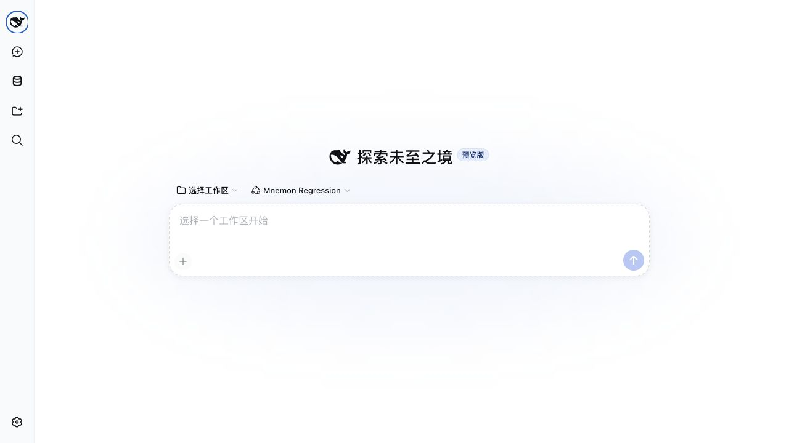
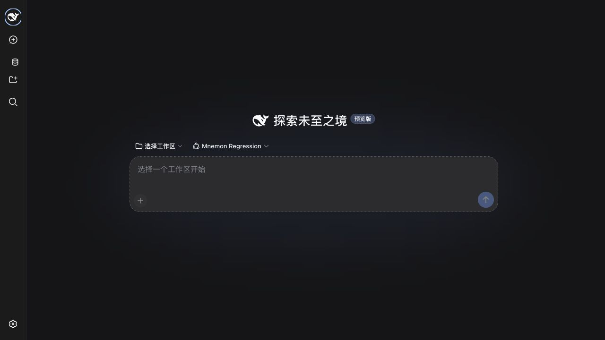
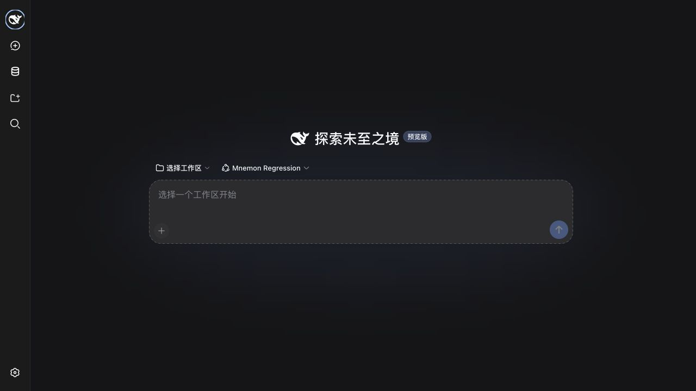
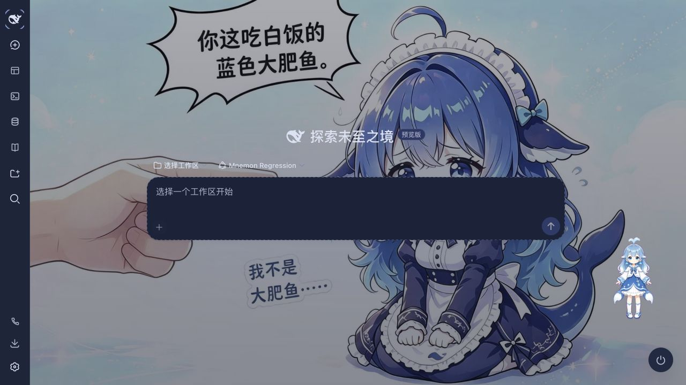
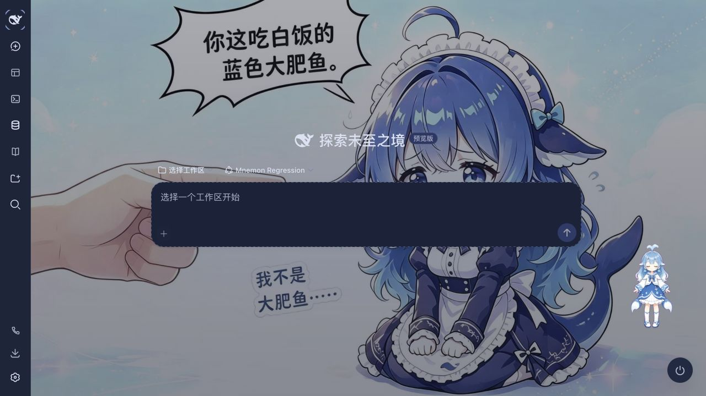

# 侧栏图标回归证据 / Sidebar icon regression evidence

本目录记录 issue [#141](https://github.com/omdsh-dev/dsh-mnemon/issues/141) 的实机验证，不替换发布截图。修复前基线是 `d6fa550`；修复代码为 `66ce4be`，已同步最新 `main` 的 `0b4a9af`。截图使用 1280 × 720 的默认浏览器视口。

These are live regression artifacts for issue #141, not replacement release screenshots. The original baseline is `d6fa550`; the fix is code commit `66ce4be`, rebased onto `main` at `0b4a9af`. Screenshots use the browser's default 1280 × 720 viewport.

## 修复范围 / Scope

原生 DSH frame 只有 `data-sidebar-collapsed`，不会添加第三方 Web UI 的 `data-dsh-frame`；旧选择器因此未应用居中和隐藏文字的规则。折叠入口现在直接响应原生标记，使用与原生图标一致的 primary label 色，并仅在折叠时把 SVG 调整到 20px，以补偿数据库图案内部留白。

The native DSH frame exposes `data-sidebar-collapsed` without the Web UI plugin's `data-dsh-frame`, so the previous selector missed centering and label hiding. The collapsed entry now follows the native marker, uses the native primary label color, and increases only the collapsed SVG to 20px to compensate for its internal padding.

生产代码仅修改一个 CSS 文件，新增 9 行、删除 2 行；没有新增 JavaScript、监听器或状态。展开时保留原有 18px SVG、24px 图标容器、间距、文字和 secondary label 色。已复核中英文 UI、快速开始、配置和运维指南；现有操作与配置无需改写。

Production changes are limited to one CSS file: 9 additions and 2 deletions, with no JavaScript, observers, or state changes. Expanded styling retains the original 18px SVG, 24px icon container, spacing, label, and secondary label color. The English and Chinese UI, getting-started, configuration, and operations guides were reviewed; workflows and configuration need no revision.

## 实测 / Measurements

[measurements.json](./measurements.json) 保存稳定布局的 DOM 测量、源码与构建 SHA-256。测量在宿主折叠动画结束后进行；图案绘制尺寸包含描边估算，不把 SVG 画布大小等同于可见图案大小。

[measurements.json](./measurements.json) records settled DOM geometry and source/build SHA-256 hashes. Measurements wait for the host's collapse animation; painted bounds account for stroke width instead of treating SVG viewport size as artwork size.

| 场景 / Scenario | 修复前 / Before | 修复后 / After |
| --- | --- | --- |
| 原生图标水平中心偏差 / Native horizontal center offset | +4px | 0px |
| 原生浅色图标 / Native light icon | `rgb(97, 102, 107)` | `rgb(15, 17, 21)`, matches native |
| 原生深色图标 / Native dark icon | `rgb(207, 211, 214)` | `rgb(249, 250, 251)`, matches native |
| Web UI 0.3.9 图标 / Web UI 0.3.9 icon | `rgb(169, 183, 208)` | `rgb(219, 226, 242)`, matches native |
| 折叠 / 展开 SVG / Collapsed / expanded SVG | 18px / 18px | 20px / 18px |

修复后数据库图案绘制高度约 16.88px，邻近“新建会话”图案约 17.27px。数据库保留自身较窄的比例。原生展开入口的矩形、图标矩形、颜色和文字宽度与修复前完全一致；Web UI 展开状态也已逐项核对。

The fixed database artwork is approximately 16.88px high, compared with 17.27px for the neighboring New Session artwork. Its narrower database proportions are preserved. Native expanded entry/icon rectangles, color, and label width match the baseline exactly; Web UI expanded styling was also checked.

## 截图 / Screenshots

| 场景 / Scenario | 修复前 / Before | 修复后 / After |
| --- | --- | --- |
| 原生浅色 / Native light |  |  |
| 原生深色 / Native dark |  |  |
| Web UI 0.3.9 |  |  |

展开状态 / Expanded states: [原生浅色 / native light](./after-classic-light-expanded.jpg), [Web UI 0.3.9](./after-web-0.3.9-expanded.jpg).

## 环境与验证 / Environment and validation

- macOS arm64, Node.js 25.1.0, pnpm 11.19.0; npm DSH 0.1.1-rc.2, optional `@linxin666/dsh-web-all@0.3.9`, checksum-verified Mnemon CLI 0.2.6.
- `pnpm run verify`: 630 passed, 1 Windows-only smoke test skipped; 108 deterministic build files; 35 Headless tools including 5 representative Mnemon tools; 115 package files; 10 public Node entries; publint strict and attw passed.
- Browser checks cover native light/dark, decorated Web UI, collapse/expand, hover/active styling, accessible labels, and opening/returning from Memory System. Task Board round trips retain the selected memory page. No browser console errors were observed.
- The existing rc.2 dependency source-map warnings and Web UI 0.3.9 Host `session/list` startup warning are unrelated to this CSS change. No DSH or third-party package code was modified.

所有实例使用独立的 DSH_HOME、记忆目录、工作区和随机 loopback 端口；模型仅返回本地固定文本，不调用付费服务，不访问个人记忆。截图不包含凭据或私人数据。

Each instance uses an isolated DSH_HOME, memory directory, workspace, and random loopback port. The model returns local fixed text, with no paid service or personal memory access. Screenshots contain no credentials or private data.

复现 / Reproduce after building:

```sh
pnpm run verify
node scripts/serve-web-regression.mjs --cli /path/to/test-owned/mnemon --web-ui none
node scripts/serve-web-regression.mjs --cli /path/to/test-owned/mnemon --web-ui @linxin666/dsh-web-all@0.3.9
```

只创建 open PR 供审核；不合并、不发版。 / Open PR for review only; no merge or release.
