# Source page frame verification / Source 页面框架验证

Runtime, Documents and Memory Spaces now share Status's outer inset and page scroll container. Memory Spaces owns one fixed title/tab header; its subordinate headings scroll with the content. Source business rendering and bounded readers remain in the independent Source packages.

运行时、档案和记忆空间现在复用状态页的外层边距与页面滚动容器。记忆空间自行维护固定标题与 Tab 组合头部，下级标题随内容滚动。业务渲染与有界阅读区仍由独立 Source 包负责。

## Environment and artifacts / 环境与制品

- Published, unmodified DSH `0.1.7-rc.2`; English dark WebUI. / 正式发布、未修改的 DSH `0.1.7-rc.2`，英文深色 WebUI。
- Baseline / 基线：`6d79c663262f71c4309cd6db5bd70b204abb143d` (`main`, `0.5.15`).
- Initial frame and scroll measurements / 初始框架与滚动测量：`4a5511f7a306447b41d64f6deef3c24ff593226e`.
- Final code / 最终代码：`34da8b03d0bf2832aadd435a3331ea8ff44907e2`.
- Both isolated WebUI environments were reinstalled through the official DSH CLI with all 17 final artifacts; installed runtime JS/CSS hashes matched. Paired after screenshots and the Related after screenshot use this final code. / 两个隔离 WebUI 环境均通过官方 DSH CLI 重新安装全部 17 个最终制品，安装后 runtime JS/CSS 哈希一致。成对对比中的修复后截图与关联区修复后截图均使用最终代码。
- Root and all 16 independent plugins are packed separately. Exact final artifact hashes are in [SHA256SUMS](SHA256SUMS). Package versions retain their pre-release-test values; hashes identify the tested bytes. / Root 与全部 16 个独立插件分别打包，最终制品的精确哈希见 [SHA256SUMS](SHA256SUMS)。包版本保留发布前测试值，以哈希标识受测字节。
- Fixtures contain synthetic acceptance data only. Screenshots include temporary fixture paths, not credentials or private memory. / 测试只使用合成验收数据；截图中出现的是临时测试路径，不含凭据或私人记忆。

| Artifact / 制品 | Version / 版本 | SHA-256 |
| --- | --- | --- |
| Root `dsh-mnemon` | `0.5.15` | `f46f8ae53727e66958d96f4872dc82cd4bf0807b4e8412dee61d93d62d2fc538` |
| Memory Spaces Source | `0.5.9` | `23f608d5ed2a67d5274cee6cf651ac3b40767e6443eb2eae2c85241a87f7c49f` |

## Same-size comparison / 同尺寸对比

Both runs use a `693 × 983` viewport with the DSH sidebar expanded to `280px`. Coordinates refer to each page's first heading. Status is the reference in the same viewport; the three Source pages now match it exactly. [measurements.json](measurements.json) records final heading coordinates and the initial frame build's canvas heights separately.

两次均使用 `693 × 983` 视口，DSH 侧栏展开为 `280px`。坐标取各页首个标题；以同一视口中的状态页为基准，三个 Source 页现在与它完全一致。[measurements.json](measurements.json) 分别记录最终标题坐标与初始框架版本的 canvas 高度。

| Page / 页面 | Before `(x, y)` / 修复前 | After `(x, y)` / 修复后 |
| --- | --- | --- |
| Status / 状态 | `(292, 123.148)` | `(292, 123.148)` |
| Runtime / 运行时 | `(305, 141.148)` | `(292, 123.148)` |
| Documents / 档案 | `(305, 141.148)` | `(292, 123.148)` |
| Memory Spaces / 记忆空间 | `(308, 135.148)` | `(292, 123.148)` |

| Page / 页面 | Before / 修复前 | After / 修复后 |
| --- | --- | --- |
| Status / 状态 | 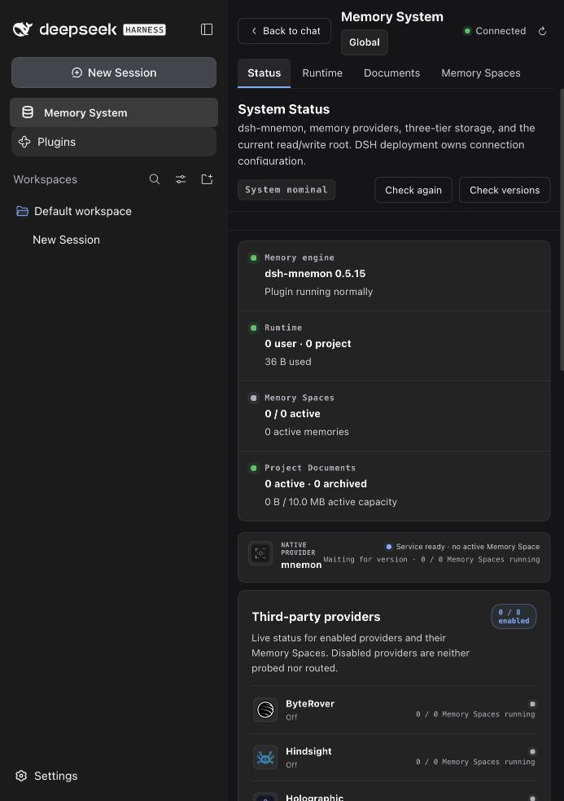 | 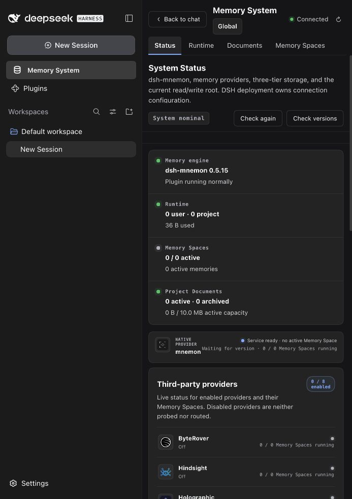 |
| Runtime / 运行时 | 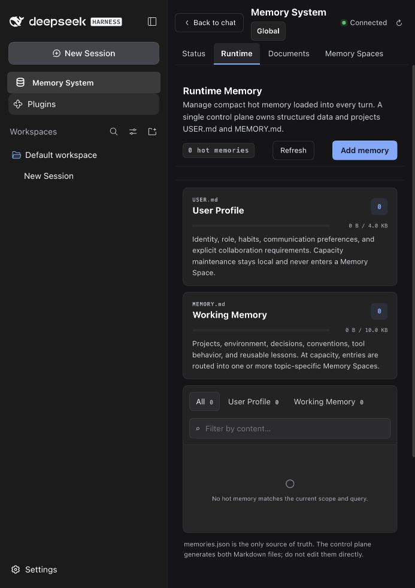 | 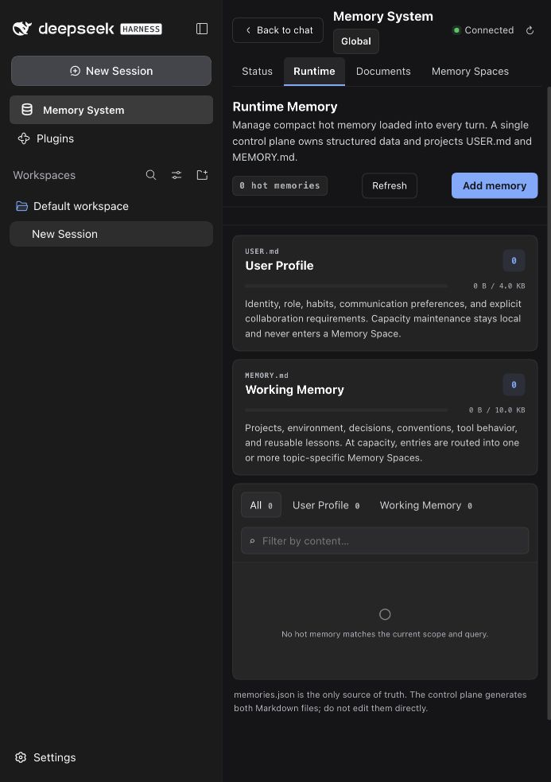 |
| Documents / 档案 | 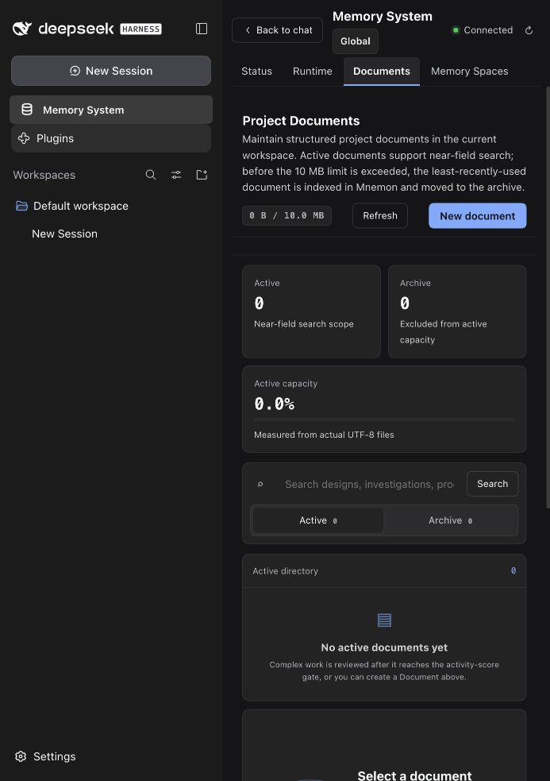 | 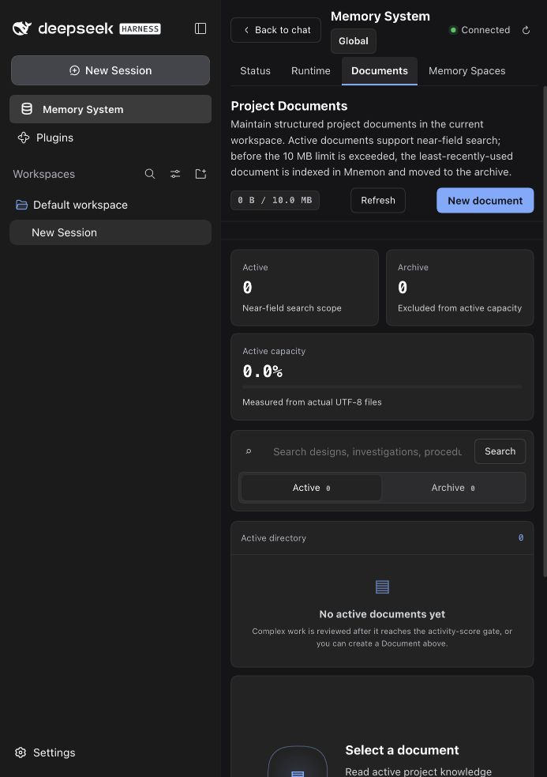 |
| Memory Spaces / 记忆空间 | 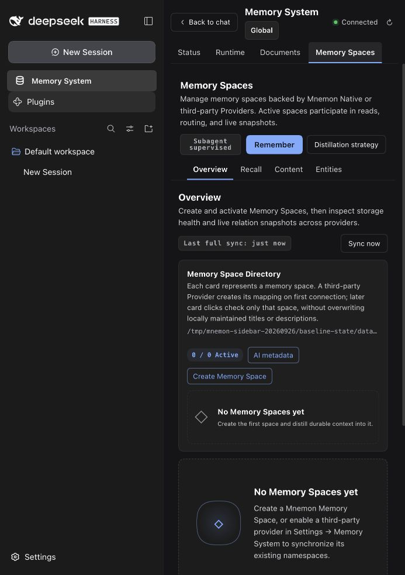 | 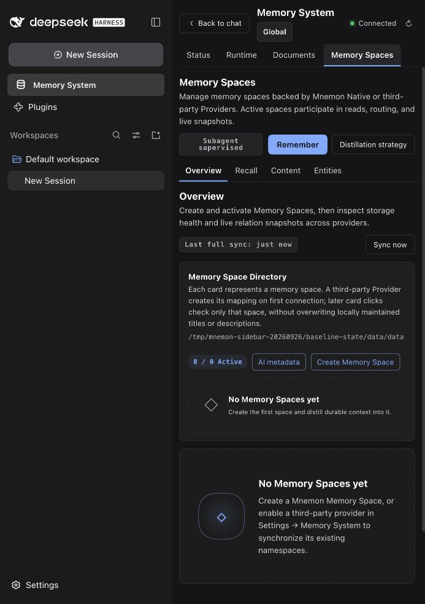 |

## Scroll and functional checks / 滚动与功能验证

At `1280 × 720`, all four primary headings start at `(296, 101.148)`. Scrolling the Memory Spaces canvas by `135.5px` keeps the primary heading at `y=101.148` while Overview moves with the content. Selecting Recall resets only the canvas to `scrollTop=0`.

在 `1280 × 720` 下，四页主标题均从 `(296, 101.148)` 开始。记忆空间 canvas 滚动 `135.5px` 后，主标题仍位于 `y=101.148`，概览随内容移动。切换到检索后，所属 canvas 回到 `scrollTop=0`。

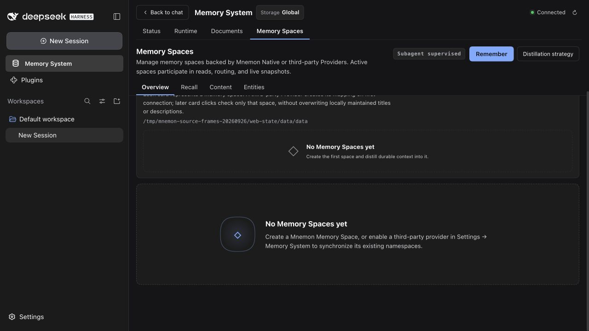

Real UI actions also created one Runtime entry and a `503 B` Document, then found the Document with the keyword `bounded scroll`. A Native Memory Space was created and activated; the real Mnemon CLI wrote 12 synthetic memories sharing `FrameAcceptance`, and Content plus keyword Recall displayed them.

真实 UI 还成功创建了一条运行时条目和一个 `503 B` 档案，并通过关键词 `bounded scroll` 检索到档案。已创建并激活 Native 记忆空间，真实 Mnemon CLI 写入了 12 条共享 `FrameAcceptance` 实体的合成记忆，内容页与关键词检索均可显示。

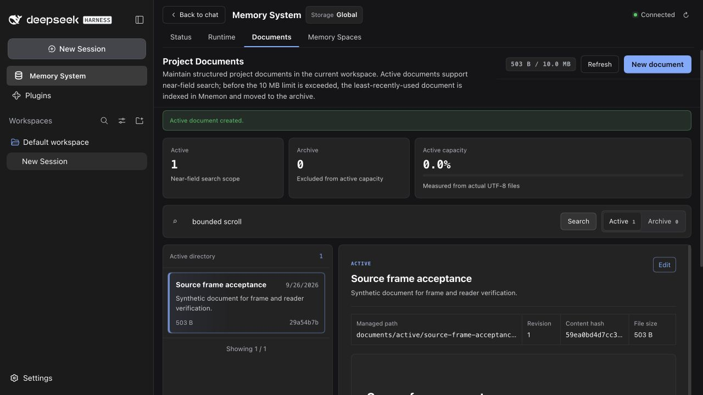

## Related reveal / 关联记忆定位

The intermediate frame build exposed a second issue: after keyword Recall, opening a lower result's related memories put its heading at `y=124.094` and close button at `121.719–147.719`, behind the fixed header ending at `y=208.188` (`canvas.scrollTop=473.5`).

框架修复后的中间版本暴露出另一问题：关键词检索后，从靠下的结果打开关联记忆，标题位于 `y=124.094`，关闭按钮位于 `121.719–147.719`，被底边位于 `y=208.188` 的固定头部遮挡（`canvas.scrollTop=473.5`）。

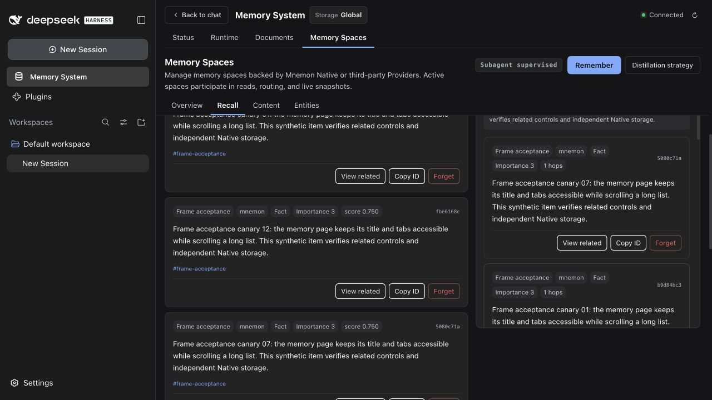

Final `34da8b03` real WebUI reveal verification **passed**: the heading is at `y=245.094` and the close button at `242.719–268.719`, below the unchanged header bottom `208.188`; clicking Close succeeds. Automated regressions pass for both header heights, close/unmount cancellation, stale element rejection and two simultaneous Workbench instances. The Source owns its header/pane refs; the optional Host callback writes only the owning canvas's `scrollTop`.

最终 `34da8b03` 的真实 WebUI 定位验收**通过**：标题位于 `y=245.094`，关闭按钮位于 `242.719–268.719`，均在未变化的头部底边 `208.188` 下方，点击关闭成功。自动回归已覆盖两种头部高度、关闭与卸载取消、失效元素拒绝及两个同时存在的工作台。Source 持有自身头部与关联区 ref，可选 Host 回调只修改所属 canvas 的 `scrollTop`。

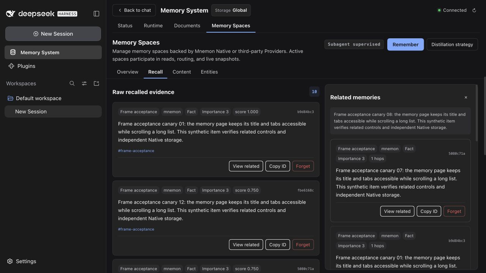

## Supplemental combined preview / 补充组合预览

Integration checkout `68f74fb849214ba3fa4e295eef8f77f72289469d` combines PR #287's Native Sidebar (`29e74522`) with Source commits `4a5511f7` and `34da8b03`. Its own 17 combined artifacts were installed in unmodified DSH `0.1.7-rc.2` and their runtime JS/CSS hashes matched. With the real Maid Atelier skin at `1055 × 983`, all four primary headings remain at `(296, 101.148)`. Native Plugins and Memory System rows both measure `x=14`, `252 × 36px`, `14px` font; 141 UI tests in 11 files, build, type and package checks pass. Switching Recall → Plugins → Memory System preserves Recall; collapsed-sidebar keyword search also returned one real Native memory. The independent PR artifacts remain the final hashes listed above.

集成 checkout `68f74fb849214ba3fa4e295eef8f77f72289469d` 组合了 PR #287 的 Native Sidebar（`29e74522`）与 Source 提交 `4a5511f7`、`34da8b03`。其专用的 17 个组合制品已安装到未修改的 DSH `0.1.7-rc.2`，runtime JS/CSS 哈希一致。在实际 Maid Atelier 皮肤与 `1055 × 983` 视口下，四页主标题仍均为 `(296, 101.148)`。原生 Plugins 与 Memory System 行均为 `x=14`、`252 × 36px`、`14px` 字体；11 个文件中的 141 项 UI 测试、构建、类型与包检查通过。检索 → Plugins → Memory System 切换后仍保留检索页，侧栏折叠时关键词检索也命中一条真实 Native 记忆。独立 PR 制品仍以上方最终哈希为准。

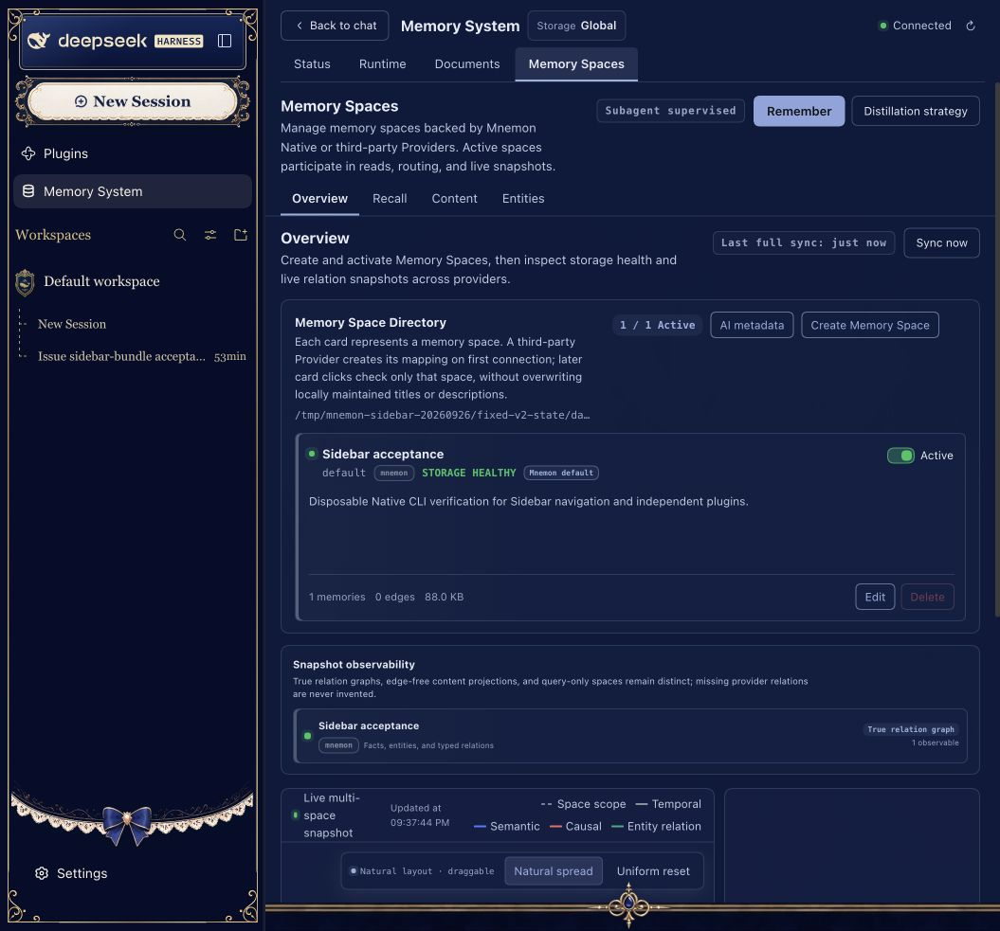

## Compatibility and automated checks / 兼容与自动验证

The new scroll callbacks are optional. The final Memory Spaces client was loaded against actual Root `0.5.1` and baseline `0.5.15` client artifacts without either callback: Content, Recall, opening/closing Related and Entities all work. Those older Hosts require manual scrolling; automatic reset and header-aware reveal are unavailable. Updating Root and Memory Spaces together provides the complete fix, without raising the existing Root peer floor.

新滚动回调均为可选。最终 Memory Spaces client 已分别加载实际 Root `0.5.1` 与基线 `0.5.15` 的 client 制品，在两个回调均缺省时验证内容、检索、打开与关闭关联记忆、实体页均可工作。旧 Host 需要手动滚动，不具备自动重置或避开固定头部的定位能力。同时更新 Root 与 Memory Spaces 可获得完整修复，无需提高现有 Root peer 最低版本。

| Check / 检查 | Result / 结果 |
| --- | --- |
| Five new reveal regressions / 五项新增定位回归 | Failed before the fix; pass after it. / 修复前失败，修复后通过。 |
| Focused Root UI suite / Root 定向 UI 测试 | 87 passed / 87 项通过 |
| Independent Memory Spaces client / 独立 Memory Spaces client | 5 passed / 5 项通过 |
| `pnpm run verify` | Passed: 100 Root test files, 1,386 tests; 8 opt-in tests skipped. Workspace checks, deterministic build, real Headless activation and package checks passed. / 通过：Root 100 个测试文件、1,386 项测试；8 项显式启用测试跳过。工作区检查、确定性构建、真实 Headless 激活与制品检查通过。 |
| `pnpm run verify:plugins` | Passed: 16 independent plugin repositories, 17 artifacts, public SDK consumer, Starter installation and three optional Strategies composed in real DSH. / 通过：16 个独立插件仓库、17 个制品、公开 SDK 消费者、Starter 安装及真实 DSH 中三个可选 Strategy 的组合。 |
| Root package budget / Root 制品预算 | `1,375,877 / 1,376,000 B`; unchanged limit. / 上限未调整。 |

Opt-in skips cover external live services/credentials, a separate published V4 contract fixture, explicit Native integration flags and Windows-only checks. Real Native CLI and WebUI coverage described above is separate from those gated suites. Node `24.20.0` and pnpm `10` were used; the two full verification commands run sequentially.

跳过项属于需要外部在线服务或凭据、独立已发布 V4 契约夹具、显式 Native 集成标志或 Windows 平台的测试。上面的真实 Native CLI 与 WebUI 验证独立于这些受开关控制的测试。验证使用 Node `24.20.0`、pnpm `10`，两条完整验证命令顺序执行。
