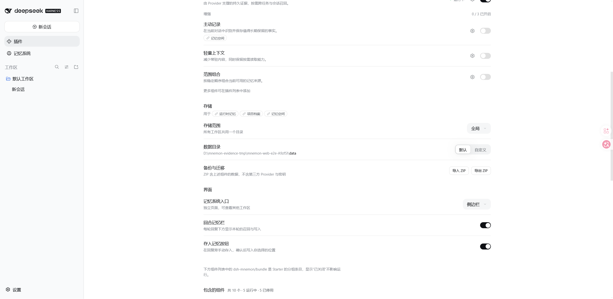
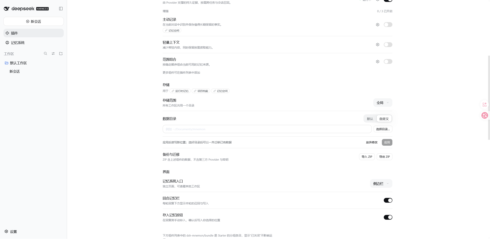
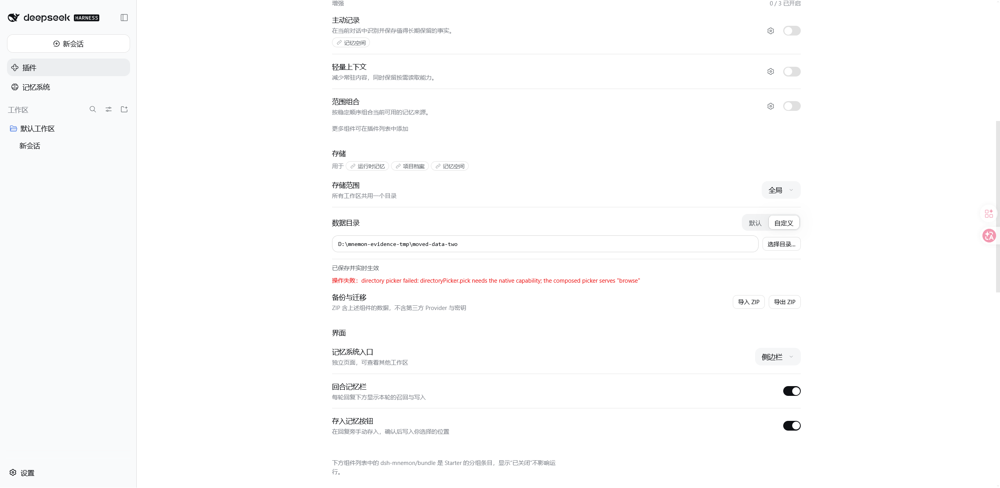

# Moving the data directory from the settings page

[简体中文](./README.zh-CN.md)

Tested implementation: `c94b3656`. Windows 11, Node 22.22.0, pnpm 11.7.0, a real `dsh web` instance served from `scripts/serve-e2e.mjs` with a disposable profile. The directory shown is that fixture's own throwaway root; no personal memory or credentials were used.

## The row shows one directory, and the choice beside it

Under **Plugins → dsh-mnemon → Storage**, the data directory row shows the directory memory actually uses and offers **Default** or **Custom**. On the default it is a statement, not a field.

## Custom opens a field, the shell's chooser and Apply

Choosing **Custom** opens the path field with the shell's own **选择目录…** button beside it. The Apply line states what applying does and that a chosen directory can carry the existing data with it.

## A shell without a native chooser says so

The chooser is a soft dependency: a Web shell that serves the browse picker but not the native one cannot open a directory dialog, and the row reports exactly that instead of failing silently or losing the typed path.

The move itself — the plan the Host reads first, the confirmation dialog that names both paths and the files and bytes it would carry, the refusal for an occupied or nested target, and the fact that nothing is deleted before every file verifies — is driven end to end in `tests/client-storage-review.spec.tsx` and `tests/storage-migration.spec.ts`, because the dialog needs a native chooser the headless fixture cannot provide.
