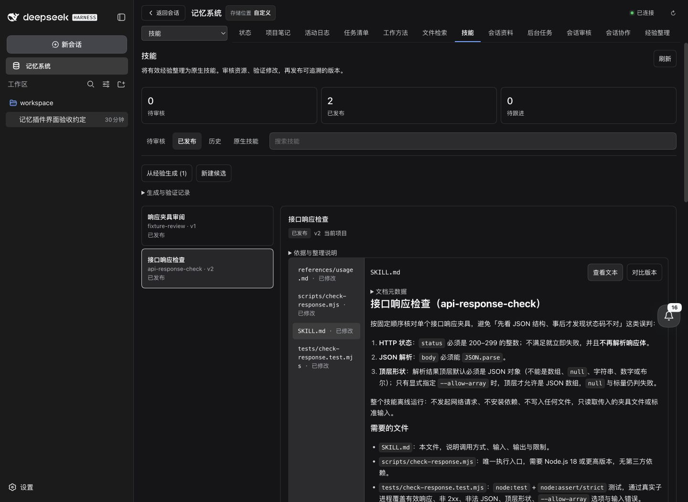
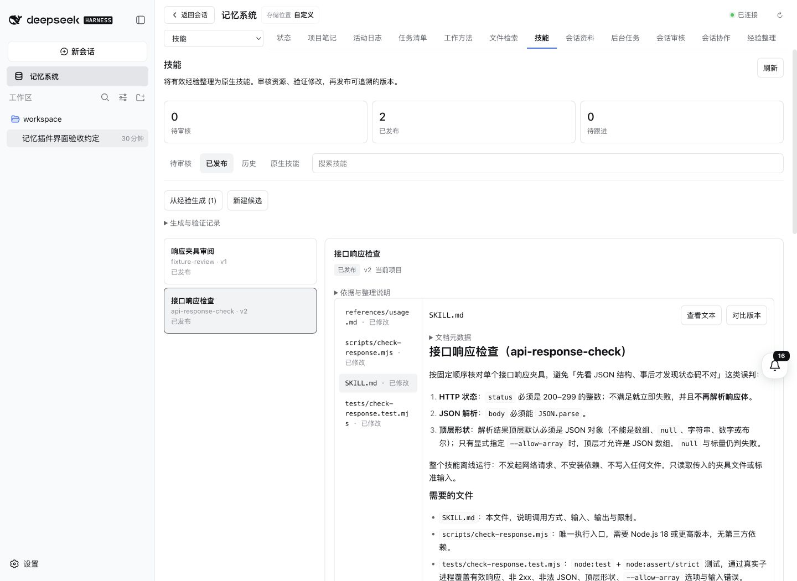
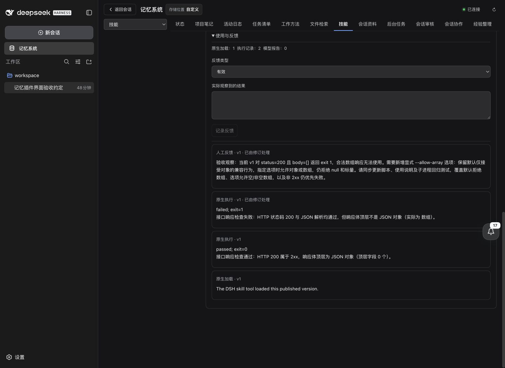
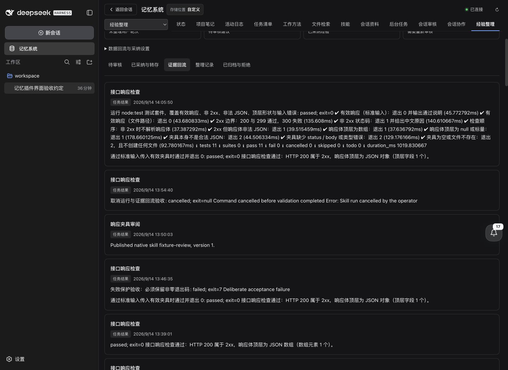

# 技能演进验收 / Skill lifecycle acceptance

2026-09-14，独立工作区中的真实 DSH 主 WebUI 已完成技能生成、脚本验证、反馈修订、审核发布和原生管理验收。使用已发布的 DSH `0.1.5-rc.1`、Mnemon `0.2.7` 和真实 `DeepSeek-V41-Flash`（High）。实现检查点为 `345d1ed`、`4df9dab`；本报告所在提交补充共享编辑器的元数据预览、对比标签和最终证据。

The real DSH main WebUI in an isolated workspace completed generation, script validation, feedback-driven revision, reviewed publication and native skill management on September 14. The runtime used published DSH `0.1.5-rc.1`, Mnemon `0.2.7` and live `DeepSeek-V41-Flash` with High reasoning. Implementation checkpoints are `345d1ed` and `4df9dab`; this report's commit adds shared editor metadata preview, comparison labels and final evidence.

[脱敏验证数据 / Sanitized validation data](pr-assets/skill-lifecycle-20260914/validation.json)记录版本摘要、实际命令状态、退出码、反馈归属和截图校验值。数据来自专用验收夹具，不包含凭据、完整会话或真实用户记忆。界面中的本地路径均属于验收目录。

The validation data records version digests, actual command outcomes, exit codes, feedback attribution and screenshot hashes. It contains dedicated acceptance fixtures, without credentials, complete conversations or real user memory. Local paths visible in the UI belong to the acceptance workspace.



## 能力归属 / Ownership

| 组件 / Component | 职责 / Responsibility |
| --- | --- |
| Playbooks Source / 工作方法 Source | 拥有技能资源、证据读取权限、候选、验证、审核发布、历史、原生目录和使用反馈。Owns resources, evidence authority, candidates, validation, publication, history, native directories and feedback. |
| Skill refinement Strategy / 技能改进策略增强 | 通过 Workspace 的公开 `skills` 扩展位提供改进规则；新技能默认要求两条独立证据，已发布技能的未解决反馈可触发修订提示，每轮最多处理一个机会。Provides refinement policy through the public Workspace `skills` slot: two independent signals by default for a new skill, unresolved feedback for a revision, at most one opportunity per turn. |
| Learning Source / 经验整理 Source | 可选提供带作用域的可复用方法，并接收带技能版本摘要的执行、验证、发布及反馈观察。Optionally supplies scoped procedures and receives attributed skill observations. |
| Core Client SDK | 共用资源导航、编辑、Markdown 预览、完整文件对比及主题组件。Shares file navigation, editing, Markdown preview, whole-file comparison and theme components. |
| DSH | 提供原生 Skill 注册表、当前会话模型和工具执行权限；脚本检查走 DSH 原生工具管线。Provides the native skill registry, current session model and execution authority. |

Source 之间仅通过公开契约和可选事件交换作用域内证据，不读取对方私有存储。策略不保存资源、不执行脚本、不发布候选。新增插件保持可选，默认配置仍采用原始三层记忆组合；完整验收 profile 单独启用了可选插件。

Sources exchange scoped evidence through public contracts and optional events without reading each other's private stores. The Strategy owns no resource files, script execution or publication. New plugins remain optional and the original three-tier composition remains the default; the full acceptance profile enables them separately.

## 真实模型闭环 / Live model lifecycle

1. 在技能页选择已有接口验收方法，通过当前会话 Flash 模型生成 `api-response-check`。候选包含 `SKILL.md`、`scripts/check-response.mjs`、`references/usage.md` 和 `tests/check-response.test.mjs` 四个完整资源。通过界面审核后运行原生检查，11 项真实子进程测试和一条 CLI 检查通过，再发布 v1。
2. 在主对话中加载该原生技能，分别以技能目录为 `workdir` 执行对象和数组夹具。对象返回 exit `0`，数组返回 exit `1`，Source 分别保留实际结果。通过界面记录“需要更新”反馈，要求显式 `--allow-array` 选项，并保留原有默认行为。
3. 在插件管理中启用技能改进增强，在主对话中明确要求处理这一条改进机会。Flash 实际调用一次 `skill-context`、四次 `skill-read` 和一次 `propose-skill`，保存完整的四文件修订候选；模型未执行或发布候选。
4. 在技能页逐项检查资源和版本对比。编辑候选或检查说明后，旧验证立即失效。再次运行检查，19 项真实子进程回归测试和三条 CLI 检查全部通过，覆盖默认拒绝数组、选项允许空/非空数组、对象兼容、拒绝 null/标量、非法 JSON、非 2xx 优先失败和未知选项。
5. 审核发布 v2，v1 转为历史版本；本次实际读取的失败和人工反馈标记为“已由修订处理”。主对话再次原生加载 v2 并运行数组夹具，实际 exit `0`。Learning 的证据回流保留成功、失败、发布和取消各自的状态及归属。

The same sequence was exercised with the live model: a four-file skill passed 11 subprocess tests and one CLI check; native use exposed an array-response limitation with exit `1`; explicit feedback led the enabled Strategy to inspect all four resources and propose a complete revision. After UI review, edits invalidated old validation and a new run passed 19 subprocess tests plus three CLI checks. Publishing v2 archived v1 and resolved only the inspected feedback. Native use of the published revision then accepted an array fixture with exit `0`; Learning retained the attributed outcomes.

| 发布版本 / Published version | 摘要 / Digest | 验证 / Validation |
| --- | --- | --- |
| `api-response-check` v1，已归档 / archived | `bc0d342c69dc0a0a2fd752c8261cc6f946950586d2b80737ad7c49f330c537ec` | 11 tests + 1 CLI check |
| `api-response-check` v2，已启用 / enabled | `b17ef91b7ee03909039d4fec16dd24bf21d35559ae206184f12f0a30d714c81e` | 19 tests + 3 CLI checks |
| `fixture-review` v1，已启用 / enabled | `b740d6292470cab7b39d89548065cac45b78063a6a086eee1f2efd28e437383a` | 2 instruction resources; structural review, no executable checks |

“人工反馈”表示显式操作入口，其验收操作由 Codex 通过界面完成，不代表已有维护者人工代码审查。自动策略本次在真实主对话中由明确的单次请求触发；这些结果不声称已验收无人值守的长期演进。

“Human feedback” identifies the explicit operator input channel. Codex performed these acceptance interactions; maintainer code review is not claimed. The live Strategy turn used an explicit bounded request in the main conversation, so this evidence does not certify unattended long-term evolution.

## 原生管理与失败路径 / Native management and failure paths

实际界面覆盖附加目录接入、发现、搜索、资源读取和编辑、停用及重新启用。断开目录连接后，目录中的文件保留，已消失条目的详情及时清空；重新接入恢复发现。插件配置提供的目录明确标记为配置管理，不混同可移除的界面接入项。

The UI exercised directory connection, discovery, search, resource reading/editing, disabling and re-enabling. Disconnecting a directory preserved its files and cleared a selected entry that disappeared; reconnecting restored discovery. Plugin-configured roots are clearly distinguished from roots connected in the UI.

原生 `fixture-review` 的首次生成响应不是合法 JSON，失败记录保留且未保存候选。重试生成了两个完整文档资源，结构检查发现元数据不一致；通过界面修正后审核发布。原文件与导入时的资源逐字节一致。此技能不含脚本，界面明确显示零条验证检查；托管版本通过原生目录提供，并在停用时维持停用状态，不回退到同名原文件重新激活。

The first native `fixture-review` generation returned malformed JSON and saved no candidate. A retry produced two complete instruction resources; structural inspection caught mismatched metadata, which was corrected through the UI before publication. Original files match the imported resources byte for byte. The instruction-only bundle declares zero checks. The managed version is exposed through the native catalog and remains disabled when toggled off, without reactivating the original same-name entry.

| 验收操作 / Action | 实际结果 / Observed result |
| --- | --- |
| 修改已验证候选 / Edit a validated candidate | 清除旧验证，发布按钮不可用，要求验证当前摘要。Clears validation and requires checks for the current digest. |
| 声明元数据与 `SKILL.md` 不符 / Metadata mismatch | 显示结构错误并阻止发布。Shows a structural error and blocks publication. |
| 检查主动退出 `7` / Deliberate exit `7` | 记录失败及真实退出码，另一条成功不覆盖失败。Records the nonzero result; another passing check does not override it. |
| 取消等待中的命令 / Cancel a running check | 最终复测保留 `cancelled`、空退出码及 Learning warning，候选不发布。Final repeat retains `cancelled`, no exit code and a Learning warning without publishing. |
| 从历史恢复 v1 / Restore v1 from history | 新建待审核版本，不改变已启用 v2；验收候选最终不采纳。Creates a pending version while v2 remains enabled; acceptance candidates were dismissed. |
| 停用再启用托管版本 / Toggle a managed version | 原生目录同步状态，保留资源和历史。Native catalog reflects state while resources and history remain. |

早期取消记录仍保留当时底层工具返回的 `blocked` 状态；最终修复后的重复验收保留 `cancelled`，并补齐回流观察。旧记录没有被重写成成功。最终保留两个已启用的发布版本、零个待审核候选、零条待跟进反馈，供继续测试。

An earlier cancelled run retains its original `blocked` tool transport result. The final repeated check records `cancelled` and emits the missing observation; old evidence was not rewritten as success. The final fixture contains two enabled published versions, zero pending candidates and zero unresolved feedback items.

## 工程验证 / Engineering validation

```sh
pnpm typecheck
pnpm -r typecheck
pnpm test:root
pnpm -r test
pnpm exec node scripts/verify-plugin-artifacts.mjs --skip-build
pnpm verify:headless
pnpm verify:package
pnpm verify:docs
pnpm release:intent
```

根测试 1,045 项通过、6 项 opt-in 跳过；38 个插件测试包共 471 项通过。38 个独立插件仓库和 39 个打包制品通过独立安装、类型检查、测试及构建，覆盖外部 SDK/Client 消费、实际 DSH Starter 安装升级和可选策略激活。类型检查、构建、文档与 changeset 覆盖通过。最终整包检查包含 53 个文件、312,881 字节压缩体积、1,415,682 字节解压体积，12 个 Node 入口、30 个公开类型依赖及可执行帮助均通过，publint 与 attw 通过。

Root tests passed 1,045 cases with six opt-in skips. All 38 plugin test packages passed 471 tests. The artifact check verified 38 independent plugin repositories and 39 tarballs through standalone installation, type checking, tests and builds, including external SDK/Client consumers, real DSH Starter installation/upgrade and optional Strategy activation. Type checking, builds, documentation and changeset coverage passed. Final package checks covered 53 files, 312,881 packed bytes, 1,415,682 unpacked bytes, 12 Node entries, 30 public type dependencies, executable help, publint and attw.

Headless 检查在本轮通过真实启动、39 个工具（含 8 个代表性 Mnemon 工具）、重启、迁移和整体停用。默认组合保持不变由配置与制品检查覆盖。最终提交的 CI 状态在 PR 中单独标明，避免将较早提交的 CI 结果视为最终提交结果。

Headless checks in this task passed real activation with 39 tools, including eight representative Mnemon tools, restart, migration and whole-Starter disabling. Configuration and artifact checks cover the unchanged default composition. The PR separately identifies CI for its final commit instead of treating an earlier commit's status as final.

检查限制：整条 shell 命令的结果只证明其整体退出状态，不能证明被尾随命令掩盖的内部脚本成功；执行归属要求精确技能资源路径或工作目录。没有独立目录归属的单个 Markdown 原生条目按只读内容处理。未运行 Windows 专用和大范围 Flash 压力测试，也不将本轮结果视为任意外部 Provider 优先级、账号渠道或所有生成代码质量的保证。

Limits: an overall shell result does not prove success of an inner script whose failure was masked. Attribution requires an exact skill resource path or workdir. Standalone native Markdown entries without directory ownership remain read-only content. Windows-only and broad Flash stress suites were not run; these checks do not certify arbitrary external Provider precedence, account/channel availability or all generated code quality.

## 逐项截图 / Screenshot gallery

29 张截图直接取自真实主 WebUI，未拼接或修改。桌面为 1440 × 1050，窄屏为 390 × 844；窄屏 DOM 宽度检查为 390，无页面横向溢出。深浅主题、文件导航、预览和垂直排列的版本对比均已交互检查。生成入口截图展示最终可用表单；历史运行截图保留实际发生时间，不表示重新调用模型。

These 29 screenshots were captured directly from the real main WebUI without compositing or image edits. Desktop captures use 1440 × 1050 and narrow captures 390 × 844; the narrow document width is 390 with no page overflow. Both themes, file navigation, preview and vertically stacked comparisons were checked interactively. Generation-entry captures show the final available forms; historical run captures retain actual timestamps and do not imply additional model calls.

| 能力 / Capability | 截图 / Screenshot |
| --- | --- |
| 选择证据与生成要求 / Evidence and generation requirements | [01](assets/skill-lifecycle-20260914/01-evidence-generation-dark.png) |
| 原始脚本 11 项测试的真实验证 / Original script's 11-test validation | [02](assets/skill-lifecycle-20260914/02-native-validation-dark.png) |
| Source 与策略增强启用 / Source and Strategy activation | [03](assets/skill-lifecycle-20260914/03-optional-plugin-enabled.png) |
| 主对话原生使用的成功和失败 / Native success and failure in the main conversation | [04](assets/skill-lifecycle-20260914/04-native-skill-main-conversation.png) |
| 策略读取资源后生成完整修订 / Complete revision after resource inspection | [06](assets/skill-lifecycle-20260914/06-strategy-generated-revision.png) |
| 脚本版本对比 / Script version comparison | [07](assets/skill-lifecycle-20260914/07-resource-version-comparison.png) |
| 编辑使旧验证失效 / Editing invalidates prior validation | [08](assets/skill-lifecycle-20260914/08-edit-invalidates-validation.png) |
| 19 项回归及 CLI 检查 / 19 regression cases and CLI checks | [09](assets/skill-lifecycle-20260914/09-regression-checks-passed.png) |
| 发布修订后的原生执行 / Native execution of the published revision | [10](assets/skill-lifecycle-20260914/10-published-revision-native-execution.png) |
| 附加目录与原生发现 / Additional roots and native discovery | [11](assets/skill-lifecycle-20260914/11-native-directory-discovery.png) |
| 原生技能停用 / Disable a native skill | [12](assets/skill-lifecycle-20260914/12-native-skill-disabled.png) |
| 原生资源编辑 / Edit native resources | [13](assets/skill-lifecycle-20260914/13-native-resource-editing.png) |
| 从原生技能请求修订 / Request refinement of a native skill | [14](assets/skill-lifecycle-20260914/14-native-revision-request.png) |
| 模型生成失败记录 / Retained model generation failure | [15](assets/skill-lifecycle-20260914/15-generation-failure-retains-original.png) |
| 历史版本反馈解决状态 / Resolved feedback on the historical version | [16](assets/skill-lifecycle-20260914/16-version-history-feedback-resolved.png) |
| 历史恢复进入待审核 / History restoration creates a pending candidate | [17](assets/skill-lifecycle-20260914/17-restoration-requires-review.png) |
| 非零退出码保留 / Nonzero exit-code retention | [18](assets/skill-lifecycle-20260914/18-nonzero-result-blocks-publication.png) |
| 最终取消状态 / Final cancellation outcome | [19](assets/skill-lifecycle-20260914/19-cancelled-check-retains-candidate.png) |
| 结构检查阻止发布 / Structural validation blocks publication | [20](assets/skill-lifecycle-20260914/20-native-candidate-structure-check.png) |
| 原生文档修订资源对比 / Native instruction-resource comparison | [21](assets/skill-lifecycle-20260914/21-native-resource-review.png) |
| 原生目录中的托管发布版本 / Managed publication in the native catalog | [22](assets/skill-lifecycle-20260914/22-native-managed-version.png) |
| Learning 中的成功、失败与取消回流 / Success, failure and cancellation returned to Learning | [23](assets/skill-lifecycle-20260914/23-learning-feedback-return.png) |
| 深色记忆系统全景 / Dark memory sidebar panorama | [24](assets/skill-lifecycle-20260914/24-memory-sidebar-panorama-dark.png) |
| 浅色记忆系统全景 / Light memory sidebar panorama | [25](assets/skill-lifecycle-20260914/25-memory-sidebar-panorama-light.png) |
| 浅色窄屏技能页 / Light narrow skills page | [26](assets/skill-lifecycle-20260914/26-skills-mobile-light.png) |
| 浅色窄屏资源对比 / Light narrow resource comparison | [27](assets/skill-lifecycle-20260914/27-resource-comparison-mobile-light.png) |
| 深色窄屏资源对比 / Dark narrow resource comparison | [28](assets/skill-lifecycle-20260914/28-resource-comparison-mobile-dark.png) |
| 托管版本停用后的原生状态 / Native state after disabling a managed version | [29](assets/skill-lifecycle-20260914/29-published-skill-disabled.png) |
| 目录断开后清除失效详情 / Clear stale detail after directory disconnection | [30](assets/skill-lifecycle-20260914/30-directory-disconnected.png) |






