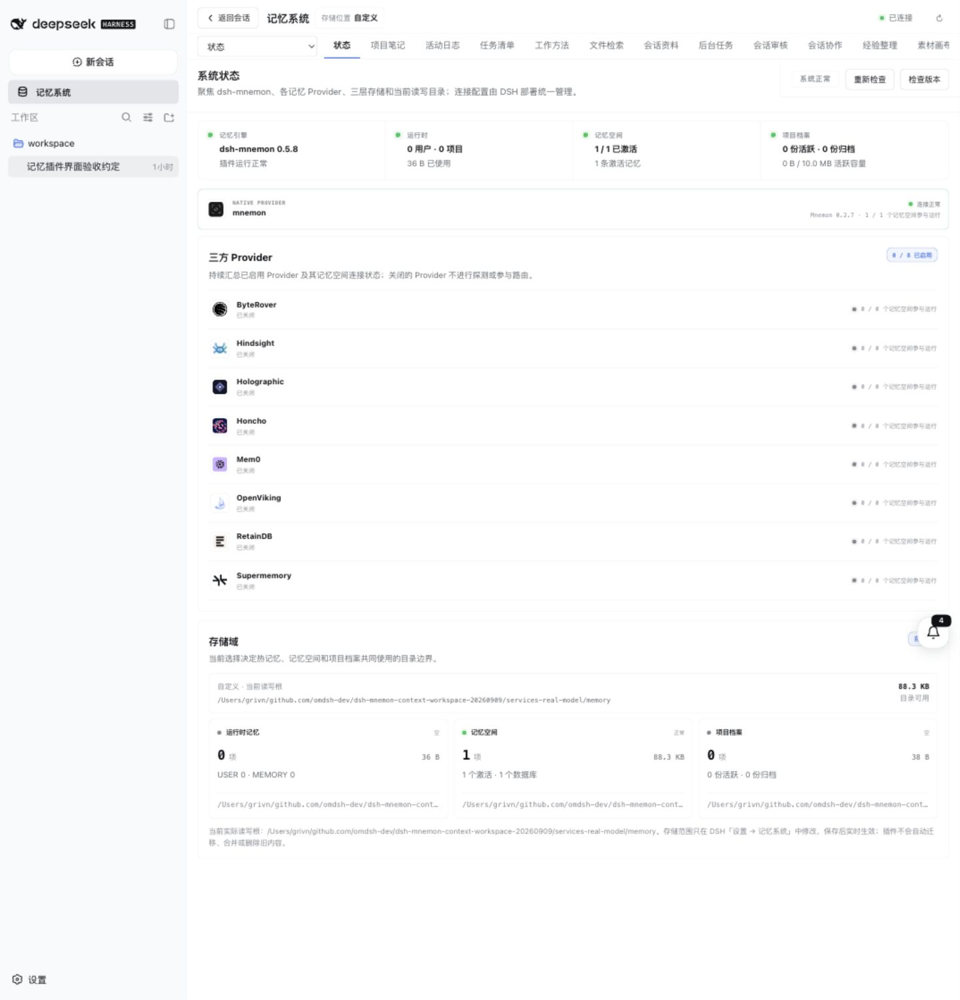
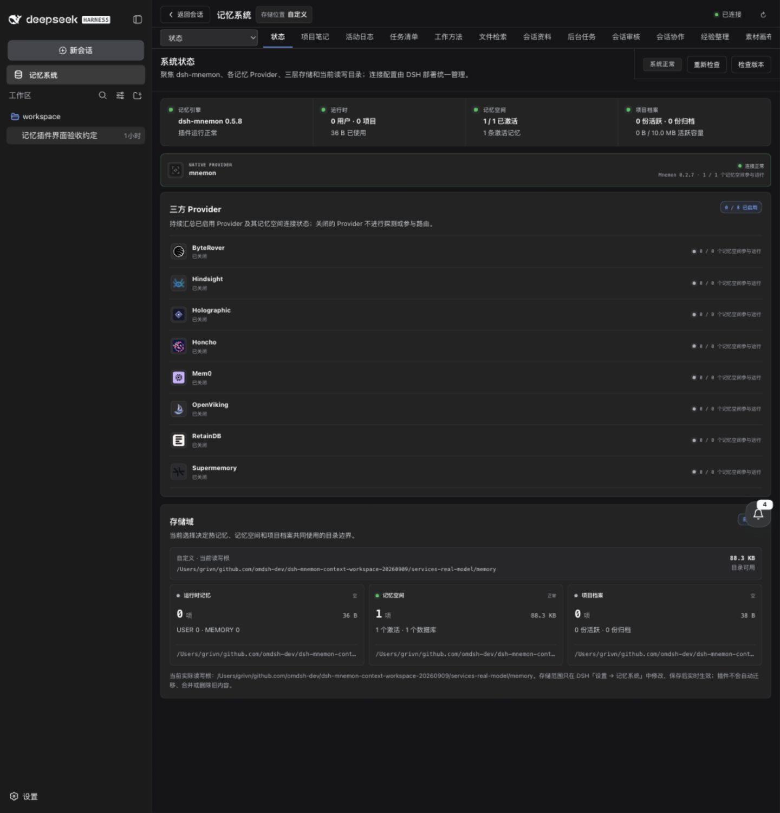

# 经验整理与插件管理验收 / Learning and plugin management acceptance

本轮在独立 worktree 的真实 DSH 主 WebUI 完成交互，使用已发布的 DSH `0.1.5-rc.1`、Mnemon `0.2.7` 和 `deepseek-flash`。首次认证通过打开 `dsh web` 输出的完整 URL 恢复；截图只保留认证后的页面。实现检查点为 `c4a439c`，此前的界面修正在 `6be9dbe`。默认配置保持原始三层组合，完整工作区组合仅在隔离验收 profile 中开启。

These screenshots come from interactions in the actual DSH main WebUI, using published DSH `0.1.5-rc.1`, real Mnemon `0.2.7` and `deepseek-flash` in an isolated worktree. Opening the exact URL printed by DSH restored browser authentication. Screenshots retain authenticated pages only. The implementation checkpoint is `c4a439c`, including the earlier UI fixes in `6be9dbe`. The original three-tier composition remains the default; the full workspace composition is explicitly enabled in the acceptance profile.

## 全景 / Panorama

## 本轮闭环 / Observed outcomes

真实主会话完成 4 轮人工输入。经验整理从重复证据提出待审核偏好、事实与方法，采纳前不会生效；方法转入工作方法 Source 后，目标采纳状态正确回传。人工负反馈保留旧偏好，并生成可对照的修订，批量采纳后原条目归档。失败的模型整理保留未处理证据，重试成功后能继续审核。最终有 3 条已采纳或已转存经验，以及 1 条新待审核方法。

取消后台任务后，Source 保存 `status: cancelled` 和 `level: warning`，等待输出没有被当作成功。最后一次真实 Flash 整理明确排除了助手自述、审核输出与取消任务作为独立人工确认或成功证据。该轮覆盖了全部 4 个人工轮次与 9 条结果证据，没有凭空增加人工轮次。

The main conversation contains four actual human turns. Repeated evidence produced pending preferences, facts and procedures. A procedure transferred to the Playbooks Source stayed pending until destination approval, which flowed back to Learning. Explicit negative feedback retained the current preference and produced a compared revision; batch approval archived the superseded original. An incomplete model review preserved outstanding evidence, and a successful retry resumed the workflow. The final view has three adopted or transferred items and one new pending procedure.

Cancelling a background process persisted `status: cancelled` and `level: warning`. Waiting output was not treated as success. The final live Flash review explicitly excluded assistant reports, reviewer output and cancelled execution as independent human confirmation or success evidence. It completed the four human rounds and nine outcome observations without adding human rounds.

## 逐项截图 / Interaction evidence

| 功能 / Capability | 实际操作与截图 / Action and screenshot |
|---|---|
| 项目 Source 模型动作 / Project Source actions | 真实主模型先查重，再提出 `decision` 待审核记录；Source 专属类型与范围约束生效。 / The real model searched before proposing a pending decision with Source-specific kinds and scopes. [会话证据 / Conversation](assets/workspace-feedback-20260914/session-live-history.png) |
| 方法移交 / Procedure handoff | 经验转入工作方法待审核，再由目标采纳；来源显示目标中已生效。 / Transfer remained pending until destination approval. [待审核 / Pending destination](assets/workspace-feedback-20260914/playbook-transfer-pending.png), [目标状态 / Destination state](assets/workspace-feedback-20260914/learning-adopted-desktop-dark.png) |
| 负反馈与修订 / Negative feedback and revisions | 记录“不准确”、保留原内容、比较修订、批量采纳。 / Record a concern, retain the original, compare and approve the revision. [回流 / Feedback](assets/workspace-feedback-20260914/learning-feedback-reopened.png), [修订 / Revision](assets/workspace-feedback-20260914/learning-reviewed-replacement.png), [批量审核 / Batch review](assets/workspace-feedback-20260914/learning-batch-review.png) |
| 任务完成回流 / Task outcomes | 创建并完成优先任务，检查历史与经验中的真实结果。 / Complete a prioritized task and inspect its history and outcome. [任务 / Task](assets/workspace-feedback-20260914/tasks-completion-light.png), [证据 / Evidence](assets/workspace-feedback-20260914/learning-task-feedback-evidence.png) |
| 插件发现与依赖 / Discovery and dependencies | 停用 Source 联动停用周期增强；启用增强的计划补入必要 Source；应用后保留原数据。 / Dependency plans disable the dependent enhancement or enable its required Source while retaining data. [停用计划 / Disable plan](assets/workspace-feedback-20260914/plugin-disable-dependencies.png), [启用计划 / Enable plan](assets/workspace-feedback-20260914/plugin-enable-dependencies.png) |
| 安装兼容性 / Installation compatibility | 对真实 npm 包检查当前版本及实际 peer 版本；相同版本显示已安装并禁止重复安装。 / Check actual registry and peer versions; an already installed version cannot be installed again. [兼容性预检 / Preflight](assets/workspace-feedback-20260914/plugin-package-compatibility.png) |
| 默认组合与可选增强 / Default and optional composition | 真实切换为三层组合，再恢复完整工作区及 5 个已选增强；分别预览后保存。 / Switch to three tiers, then restore the workspace composition and five selected enhancements. [切换计划 / Switch plan](assets/workspace-feedback-20260914/plugin-default-strategy-plan.png), [三层预览 / Three tiers](assets/workspace-feedback-20260914/default-three-tier-preview.png), [完整组合 / Workspace preview](assets/workspace-feedback-20260914/workspace-enhancement-preview.png) |
| Markdown 便签 / Markdown notes | 创建、预览、Cmd+S 保存，再打开编辑；深浅主题共享原生渲染。 / Create, preview, save with Cmd+S and reopen using shared native rendering. [创建预览 / Preview](assets/workspace-feedback-20260914/canvas-markdown-preview.png), [保存 / Saved](assets/workspace-feedback-20260914/canvas-note-saved.png), [深色编辑器 / Dark editor](assets/workspace-feedback-20260914/canvas-editor-dark.png) |
| 技能文件管理 / Skill files | 创建有效 SKILL.md、预览和编辑保存，再移除并验证隐藏恢复副本；活动文件已移除，备份保留编辑内容。 / Create, edit and archive a valid SKILL.md; verify that the active file is absent and the recovery copy retains the edit. [创建 / Create](assets/workspace-feedback-20260914/skill-file-create-preview.png), [保存 / Saved](assets/workspace-feedback-20260914/skill-file-saved.png), [保留副本 / Recoverable removal](assets/workspace-feedback-20260914/skill-file-recoverable-removal.png) |
| 真实 CLI 作业与续接 / Real CLI jobs and resume | 主 WebUI 预览命令并确认执行；两次真实 Flash 请求均正常退出，续接使用同一外部会话及四条持久消息。 / Approve the concrete command; two hosted Flash requests exit normally and resume the same session with four persisted messages. [执行计划 / Plan](assets/workspace-feedback-20260914/job-flash-execution-plan.png), [真实结果 / Result](assets/workspace-feedback-20260914/job-real-flash-complete.png), [日志回流 / Journal](assets/workspace-feedback-20260914/journal-real-job-outcomes.png) |
| 取消结果与整理 / Cancellation and learning | 在模型请求开始前取消等待进程，没有生成模型会话历史；结果与严重程度回流，真实整理明确排除成功推断。 / Cancel before the model request; no model-session history is created, and the review rejects an inference of success. [已取消 / Cancelled](assets/workspace-feedback-20260914/job-cancelled-outcome.png), [证据 / Evidence](assets/workspace-feedback-20260914/learning-cancelled-evidence.png), [整理结论 / Review](assets/workspace-feedback-20260914/learning-reviewed-cancelled-outcome.png) |
| 独立会话审核 / Independent review | 真实 Flash 仅依据可见会话指出 pending 与生效措辞的冲突，并保留不确定性及引用；结果进入经验整理。 / Review visible conversation, cite conflicting status wording and retain uncertainty. [审核结果 / Review](assets/workspace-feedback-20260914/independent-review-flash.png), [回流证据 / Evidence](assets/workspace-feedback-20260914/learning-review-and-job-feedback.png) |
| 文件检索 / File search | 查找真实工作区文件并读取带行号的片段。 / Search actual workspace files and read a line-numbered excerpt. [检索结果 / Results](assets/workspace-feedback-20260914/workspace-file-search.png) |
| 会话检索与书签 / Session search and bookmarks | 查询真实人工消息，读取相邻对话，保存和重命名书签，定位确切消息。 / Search human messages, read neighbors, save and rename a bookmark, then locate the exact message. [历史检索 / History](assets/workspace-feedback-20260914/session-live-history.png), [精确书签 / Bookmark](assets/workspace-feedback-20260914/session-bookmark-exact.png) |
| 原生模型目录 / Native model catalog | 查询真实 provider/model 条目，显示上下文、输入类型和推理选项；本轮未声称验证视觉推理。 / Inspect native model metadata; this does not establish vision quality. [Flash 目录 / Catalog](assets/workspace-feedback-20260914/native-flash-model-catalog.png) |
| 原生 Mnemon / Native memory | 主 WebUI 调度实际 Flash 沉淀任务，再通过内容页读取同一数据库中的决策，记录前缀 `68b8f5d3`。 / Dispatch a real Flash write and read the resulting decision from the same native database. [写入与读取 / Write and read](assets/workspace-feedback-20260914/native-mnemon-flash-write-read.png) |
| 通知回流与已读 / Notifications and read state | 打开取消任务通知并标记已读，未读计数从 5 降到 4。 / Open the cancelled-job notice and mark it read; unread count changes from five to four. [通知详情 / Notification](assets/workspace-feedback-20260914/notification-cancelled-read.png) |
| 窄屏、主题与设置 / Responsive themes and settings | 390 × 844 下导航、指标、标签和操作可达，页面无水平溢出；设置打开完整插件管理，可搜索可选能力。 / At 390 × 844, navigation and controls remain reachable with no document overflow; full settings support plugin search. [浅色 / Light](assets/workspace-feedback-20260914/learning-mobile-light.png), [深色 / Dark](assets/workspace-feedback-20260914/learning-mobile-dark.png), [设置 / Settings](assets/workspace-feedback-20260914/plugin-manager-mobile-dark.png), [搜索 / Search](assets/workspace-feedback-20260914/plugin-search-mobile-dark.png) |

## 验证范围 / Scope

桌面交互使用 1440 × 1000，全景另检查 1440 × 1500；窄屏为 390 × 844。截图直接来自浏览器，未重绘界面。完成后恢复原始窗口尺寸与“跟随系统”主题。认证地址、API Key、模型私有日志及验收存储不进入提交。WebUI 的软件包预检验证了兼容性与同版本防重复；新的分支包尚未发布到 npm，独立 tarball 安装、升级及激活由制品集成测试验证。

Desktop interaction used 1440 × 1000, with a 1440 × 1500 panorama check; narrow-screen checks used 390 × 844. Screenshots were captured directly from the browser. The original viewport and system-following theme were restored. Authenticated URLs, API credentials, private model logs and acceptance stores are excluded from the repository. WebUI package preflight covers compatibility and same-version prevention. Branch packages are not published to npm; independent tarball installation, upgrade and activation are verified by artifact integration tests.

本轮新增及修正能力的截图见上表；未改动的协作消息、文件预约、图片复制、提示词调度、同步冲突等流程，继续使用[对应阶段的真实 WebUI 记录](workspace-context-validation.md)。这些旧阶段中使用固定模型的结果只证明其注明的编排与交互，不能代表第三方账号可用性或模型质量。自动化真实 Flash 检查与本轮浏览器证据在[脱敏报告](pr-assets/learning-feedback-flash-20260914/validation.json)中分别记录。

The table covers this round's new and corrected capabilities. Existing collaboration, file reservations, copied images, prompt scheduling and synchronization conflicts retain their [dated real WebUI evidence](workspace-context-validation.md). Older deterministic-model checks establish their recorded orchestration and interaction only, not external account availability or model quality. Automated live Flash checks and this browser evidence are recorded separately in the [sanitized report](pr-assets/learning-feedback-flash-20260914/validation.json).
