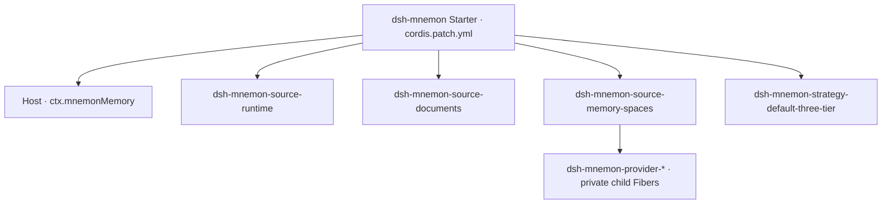
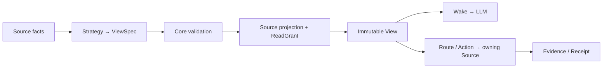

# Composable View Memory 架构

**简体中文** | [English](../en/architecture.md) | [文档中心](./README.md)

系统只有三个主要业务概念：**Source** 拥有记忆及其操作；**Strategy** 提议可用 Source 如何参与；**View** 是特定范围和场景下交给 LLM 的有界上下文与交互形态。Runtime、Documents、Memory Spaces 是默认组合，不是 Core 对所有记忆的固定分类。

## 归属与装配



图中表示安装归属，不是业务调用链。DSH 创建顶层 Entry/Fiber；Source 与 Strategy 都使用同一套 `installMemory(ctx, ...)` SDK 注册，由 Cordis 负责卸载。Core 只提供 `ctx.mnemonMemory`，不替 Memory Spaces 实现 Fiber，也不提供 `ctx.mnemonMemorySpace`。

Memory Spaces **自己定义内部 Fiber 与 Provider 协议**。每个 Provider 都来自明确安装并配置的子模块；两个 Source 实例可以使用同名子节点，各自持有独立目录和凭据。不存在扫描依赖自动选择实现、全局 Provider 注册表等隐式装配。

借鉴 Spring Boot Starter，默认发行包负责选依赖、给默认配置，不把 Source 业务收回 Core。用户仍安装 `dsh-mnemon`；贡献者可以独立开发、构建、测试、发布与安装 13 个插件包中的任意一个。其他组合显式选择 Source 实例及 Strategy。

| 归属 | 负责 | 不负责 |
|---|---|---|
| Core/SDK | 注册、协议校验、不可变 View、预算、运行代与租约 | Provider 驱动、Source 数据格式与存储决策、页面、DSH 生命周期策略 |
| Source | 数据权威、facts、投影、grant、查询/修改、可选管理协议与 Client | 其他 Source 的控制器、全局策略选择 |
| Strategy | 确定性的纯函数 `request + facts → ViewSpec` | 原始数据、凭据、驱动、副作用、扩张权限 |
| Host | scope、阶段 hook、工具/RPC、认证、设置、监督任务 | Source 私有实现与注册表 |
| Starter | 包集合、Entry id、默认配置 | 第二套加载器或运行时 |

## 默认插件组合

| 插件 | 记忆权威 | 默认 View 贡献 |
|---|---|---|
| `dsh-mnemon-source-runtime` | Runtime JSON、USER/MEMORY 投影、分支过滤与容量 | eager 精确工作上下文 |
| `dsh-mnemon-source-documents` | 受管 Markdown、索引、搜索、修订与归档 | 有界叙事封面与搜索 route |
| `dsh-mnemon-source-memory-spaces` | 记忆体目录、内部 Provider、能力与召回质量策略 | 有界持久证据封面与 recall/related route |
| `dsh-mnemon-strategy-default-three-tier` | 不存储记忆 | 选择三种角色，分配投影、route 与 action |

九个独立 Provider 插件包为 `dsh-mnemon-provider-{mnemon-native,openviking,honcho,mem0,hindsight,holographic,retaindb,byterover,supermemory}`。Provider 运行在 Memory Spaces **内部**，负责存储/检索驱动，不是 Core 的新贡献种类。Git、Notion、健康记录通常应实现 Source；不同的组合方式应实现 Strategy。

默认 Strategy 对同一默认角色出现多个实例报歧义错误。双 Notion、多 Space Source 等场景应在自己的 Strategy 中选择明确的实例 key，不能依赖导入顺序。

## View 数据流



View 包含投影片段、route、action offer 与仅留在 Host 的 ReadGrant。Wake 只渲染有界模型表示，并包含可调用 route/action 的 schema；不泄露 grant 载荷、控制器或凭据。Evidence 记录来源与一致性，不是另一份持久记忆。

Strategy 输出只是提案。Core 校验实例身份、声明能力、route/action 及预算；Host 执行时再次检查当前权限。一致性明确区分：捕获内容的 `exact-snapshot`，以及只能固定命名空间、远端内容仍可变化的 `namespace-pinned-live-read`。后者不冒充历史数据库快照。

```mermaid
sequenceDiagram
  participant DSH
  participant Host
  participant Core
  participant Source
  participant LLM
  DSH->>Host: turn begins (scope, scenario)
  Host->>Core: acquire Serving generation; compose
  Core->>Source: facts; project after Strategy selection
  Source-->>Core: fragments + opaque ReadGrant
  Core-->>Host: immutable View
  Host->>LLM: bounded Wake + routes/actions
  LLM->>Host: selected route/action + input
  Host->>Core: scope, authority and budget checks
  Core->>Source: query / mutate
  Source-->>LLM: bounded Evidence / committed Receipt via Host
  DSH->>Host: turn ends
  Host->>Core: release lease; drain retired generation
```

## 生命周期与失败

候选组合先验证，再发布。额外候选被拒绝时，不会悄悄替换 Serving 运行代；显式移除当前依赖的贡献时，该运行代退役，不再接新回合。已开始的回合和操作持有租约，结束后再排空旧 Source 及其私有资源。

每回合固定一个不可变 View。写入生成回执，后续回合读取新修订；并发父/子 Agent 不能借用另一回合的 grant。Source/Provider 故障保持局部、可观察；部分成功、失败、取消、已提交不会混为一谈。停用参与不删除数据。

## WebUI 与管理面

Source 自己拥有可选的 `./client` DSH 模块、页面、管理协议与测试，通过公开 Source 页面 SDK 注册到工作台的 `mnemon.source.page` Slot。Client 生命周期与 React 渲染仍由 DSH 管理。

Host 交给页面的是限定实例的管理客户端与脱敏元信息，不是裸 RPC、Host Context 或 LLM grant。读取和带确认、修订栅栏的修改指向一个 Source。档案归档到记忆体等默认协作由 Host 编排，也只调用公开管理协议。

Sidebar 使用 DSH `shell.overlay`，因此无会话也可打开；Buildin 使用 `conversation.view`。二者互斥挂载，共用工作台和 Source 页面，不创建第二个 React root、兜底页面注册表或复制业务页面。

## 使用兼容与未来演进

默认 Starter 保留配置键、存储选择、持久格式、具名工具及使用流程；这**不意味着**保留私有控制器、旧根包 `kernel/layers/provider-sdk` 入口和历史包装包。当前公开入口见[扩展开发](./extensions.md)。

RSI 的边界保持简洁：产出候选 Source/Strategy 制品，用固定 facts/request 测试与回放，审查权限，再按正常装配方式安装和选择。运行代支持验证后的替换与排空，不是自动执行生成代码或自动晋升服务。Cordis 的归属/隔离并非安全沙箱；高风险外部操作仍需单独的授权边界，不能以“记忆”之名自动获得权限。
