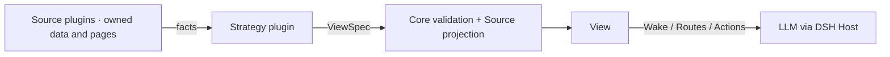

# 项目介绍：面向 DSH 的三层与跨 Agent 共享记忆系统

**简体中文** | [English](../en/project-overview.md) | [文档中心](./README.md)

`dsh-mnemon` 将长期记忆体接入 DeepSeek Harness，并补充运行时热记忆、项目档案、生命周期路由、独立任务 Agent、确定性控制层与 DSH 原生界面。第三层采用可替换 Provider：Mnemon Native 是官方优先、默认完整能力实现；8 种三方引擎通过显式适配器复用同一套记忆体工作流。

Runtime、Documents、Memory Spaces 是独立 Source 插件；Strategy 将各实例的投影、检索 route 与 action 组合成逐回合不可变 View。Core 只提供 `ctx.mnemonMemory`，Source 拥有数据与可选页面，Memory Spaces 自己拥有内部 Provider 子节点。`dsh-mnemon` Starter 保持默认三层使用体验。详见[架构](./architecture.md)与[插件开发](./extensions.md)。

它要解决的不是“保存更多文字”，而是让 Agent 在长期连续性、当前事实优先、上下文成本和可恢复写入之间取得平衡。

## 为什么需要三个层级

单一记忆层很难同时满足高频注入、完整阅读和跨会话召回：

| 需求 | 如果只有一个记忆层 | dsh-mnemon 的选择 |
|---|---|---|
| 下一轮必须知道用户偏好和稳定约定 | 每次检索有延迟，也可能漏召回 | 运行时记忆每轮注入紧凑投影 |
| 阅读完整设计、调查或流程 | 切成碎片会失去叙事和来源 | 档案保留受管 Markdown 全文 |
| 跨会话查找事实、决策和关系 | 全量加载会污染上下文 | 记忆体按需返回有界图增强证据 |
| 保留不常用长文的可追溯性 | 永久留在热层持续占容量 | 先建立冷引用，再迁移原文 |
| 让模型判断价值但不掌握系统安全 | LLM 无法保证路径、锁和事务 | 独立任务 Agent 负责语义，Host 负责硬边界 |

无论命中哪一层，优先级始终是：**当前用户指令 → 实时工具与仓库事实 → 历史记忆**。

## 三层记忆模型

### 1. 运行时记忆

运行时层保存高频、紧凑、每轮都可能使用的信息：

- `USER.md`：身份、角色、偏好、习惯和明确协作要求；
- `MEMORY.md`：项目约定、环境事实、决策、工具特性与可复用经验。

`runtime/memories.json` 是唯一事实源，两个 Markdown 文件是确定性投影。USER 上限 4 KiB，MEMORY 上限 10 KiB，均按 UTF-8 字节计算。普通增删改由控制层执行；只有容量维护才可能启动内部 worker。

### 2. 项目档案

档案保存需要完整结构的设计、调查、流程、复盘和交接。标题、检索说明与正文参与确定性搜索，正文保持 Markdown。

单份正文最大 2 MiB，active 总量最大 10 MiB。人工归档或容量整理时，插件先启动独立任务 Agent，并通过内部受限 worker 在 Mnemon 写入带摘要与 SHA-256 的冷引用，再在 revision 未变化时移动原文。失败或冲突时优先保留 active 原文。

### 3. 记忆体

每个记忆体都拥有稳定 ID、名称、路由说明、激活状态和 Provider 能力集。Mnemon Native 对应独立 Store 与 `mnemon.db`；三方记忆体对应各自 Provider endpoint、作用域、本地文件或 CLI 目录。激活仍是统一的 DSH 读取与路由控制面，可以为零或多个；Mnemon 原生默认 Store 继续保持独立的单选语义。

- 读取只覆盖已激活记忆体；
- 写入可以选择任何已登记目标，成功后自动激活；
- 跨 Provider 召回保留记忆体与 Provider 来源，在正文进入 Agent 前执行已配置的可插拔质量策略，并按各引擎内部排名融合，不直接比较异构原始分数；默认严格策略丢弃低于 `0.25` 的标准化分数结果，在请求上限内保留全部高相关度结果，并限制中相关度与未知量纲证据数量而不再补满 limit；
- 关系、实体、删除和写入方式以目标 Provider 公布的能力为准；Mnemon Native 保留完整图关系和软删除，三方引擎只开放 [Provider 能力矩阵](./memory-providers.md)中记录的语义。

三层的权威文件、容量与目录结构见[存储与三层记忆模型](./storage-model.md)。

## 跨 Agent 共享边界

这里的“共享”不是 dsh-mnemon 把对话或文件主动广播给任意 Agent，而是多个已接入 Mnemon 的 Agent 使用同一套本地 Mnemon 数据：

1. 每个参与方都安装并接入 Mnemon；
2. 每个参与方都能访问同一个 `storageRoot`；
3. 需要共享的长期记忆位于各方共同识别的 Mnemon Store 中。

满足这些条件后，Mnemon Native 记忆体中的长期事实、实体与关系可以由其他 Mnemon-enabled Agent 召回，反向写入也能被 DSH 发现。三方记忆体通过各自 Provider 作用域共享。共享范围只覆盖第三层 Provider 数据；`runtime/` 和 `documents/` 不会自动成为其他 Agent 的上下文。

`global` 默认根 `~/.mnemon` 最适合本机多个 Agent 共享；`custom` 适合显式约定的公共根；`workspace` 则把共享限制在对应项目目录。多个进程同时访问时依赖 Mnemon / SQLite 的并发语义，离线复制、迁移或直接修改数据库前应先停止所有使用者。

## 总体架构

架构由四个边界组成：

1. **交互边界**：用户通过对话、Sidebar 工作台、`/mnemon` 命令与模型工具使用记忆。
2. **监督边界**：用户可见的 AI 元信息、Agent 查询、语义写入和归档由独立顶层任务 Agent 执行；需要结构化判断时才继续调用内部受限 worker。
3. **确定性控制边界**：Host 校验范围与权限；Source 校验 schema、路径、容量、锁、revision、驱动超时与取消。
4. **数据边界**：Runtime、Documents 与 Mnemon Native 数据位于当前 `storageRoot`；第三方 Provider 只在 Host 内通过显式连接访问，浏览器不直连。

### 记忆系统流转

下面的架构图是稳定执行边界，不是实时状态面板。实线是 Host 确定性路径，虚线是独立任务 Agent 路径。

四条可见链路分别是：

- **确定性只读**：状态、直接检索、内容与实体并发读取，结果到达即展示。
- **Agent 查询**：先取得有界证据，再交给无会话历史、无 Mnemon 工具的独立任务 Agent 组织答案。
- **受监督写入**：用户确认候选后，任务 Agent 判断、查重、提炼与选路，Host 再执行权限和事务边界。
- **维护与归档**：每个记忆体的 AI 元信息任务互相隔离；档案先验证冷引用，再跨 revision fence 移动原文。

触发门槛、取消行为和失败语义见[生命周期与核心流程](./workflows.md)。

## 读取路径：由近到远

一次依赖历史的问题按以下顺序扩展：

1. 当前请求、实时工具结果和仓库文件；
2. 已在 prompt 中的 Runtime Memory；
3. active Documents 的确定性检索与按需全文；
4. 已激活 Memory Spaces 的监督召回；
5. 命中冷引用后才读取 archived 原文。

`mnemon_recall` 会启动隔离 worker。worker 根据记忆体名称和说明选择最窄范围，只能使用允许的召回与关联工具；完整路由过程与整个目录不会灌入主对话。

Web 的“直接检索”返回原始证据；“Agent 查询”先取得相同证据，再让一个无 Mnemon 工具的 evidence-only 顶层任务 Agent 组织答案。

## 写入路径：语义与系统保证分离

| 独立任务 Agent / 内部 worker 负责 | Host 硬保证 |
|---|---|
| 判断候选是否值得保存 | 输入 schema 与操作权限 |
| 选择最窄记忆体并查重 | 工作区与路径不能逃逸 |
| 提炼自包含内容与关系理由 | CLI 禁用 shell，限制输出、超时与取消 |
| 判断长内容是否应成为档案 | 文件锁、临时文件、rename 与 revision fence |
| 在 persona 范围内保守维护 | UTF-8 容量与失败时保留原数据 |

长期召回与 related 读取在 pinned MemorySource 权限下直接通过 Host 执行；语义写入可以使用隔离的 `spawn`。评分后台审查只在已完成回合达到门槛且持续空闲后使用 `fork`。新回合会取消等待或运行中的审查。

## 用户能看到什么

默认 Sidebar 只有四个一级页面：状态、运行时、档案、记忆体。记忆体再分概览、检索、内容、实体；添加、编辑和沉淀使用统一弹窗，长列表采用筛选与渐进加载。

对话内还有两个增量入口：

- **本回合记忆**：汇总本轮记忆工具活动，并支持跳到对应页面；
- **存入记忆**：把已定稿回复载入可编辑确认弹窗，只有确认后才启动监督写入。

逐页截图与工作区查看 / 执行语义见 [Sidebar 与对话交互指南](./ui-guide.md)。工具、命令和 RPC 契约见[接口参考](./interfaces.md)。

## 本地优先与可靠性

- CLI 通过参数数组启动，`shell=false`；输出、超时与取消有界。
- Runtime 与 Documents 使用进程内队列、跨实例锁、临时文件与 rename。
- Runtime revision 阻止过期压缩覆盖；Document revision 阻止移动已更新原文。
- 独立任务 Agent 与内部受限 worker 使用 persona、工具白名单、经过 schema 校验的一次性结果工具和深度限制。
- WebUI 不直接读取 SQLite，不从浏览器传入任意更新命令。
- 插件不存储模型凭据，但当前也没有确定性的秘密扫描器。

这些保证不是跨 Mnemon SQLite 与文件系统的可回滚分布式事务；项目选择在不确定时保留原数据。完整边界与已知限制见[运维指南](./operations.md)。

## 继续阅读

- [快速开始](./getting-started.md)：安装与第一次验证。
- [Sidebar 与对话交互指南](./ui-guide.md)：完整 UI 使用路径。
- [架构设计](./architecture.md)：模块、worker 与信任边界。
- [存储模型](./storage-model.md)：目录、容量与权威源。
- [生命周期与核心流程](./workflows.md)：注入、召回、写入、审查与归档。
- [配置参考](./configuration.md)：Sidebar 入口、存储范围与高级开关。
